# RISC-V-Reference-SoC-Tapeout-Program

<details>
<summary><b> Day 0 - Tools Installation</b></summary>

Understanding the flow of the tapeout program.  

The 4 major outputs i.e. the output of the "c"-code, the verilog code, the SoC output and the output of the tapeout chip should be the same. Basically the functionality is being checked at 4 major stages of the asic flow ensuring that the final product is in terms with the design application.  

## Yosys
```
$ sudo apt-get update
$ git clone https://github.com/YosysHQ/yosys.git
$ cd yosys
$ sudo apt install make (If make is not installed please install it)
$ sudo apt-get install build-essential clang bison flex \
 libreadline-dev gawk tcl-dev libffi-dev git \
 graphviz xdot pkg-config python3 libboost-system-dev \
 libboost-python-dev libboost-filesystem-dev zlib1g-dev
$ make config-gcc
$ make
$ sudo make install 
```
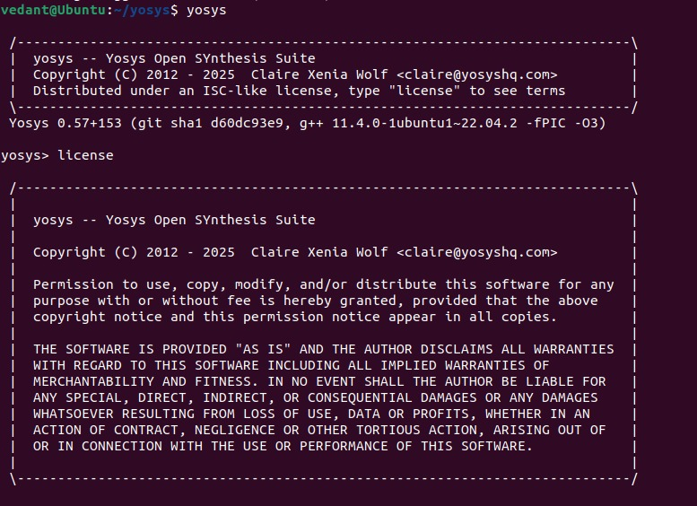


## Iverilog
```
sudo apt-get update
sudo apt-get install iverilog 
```
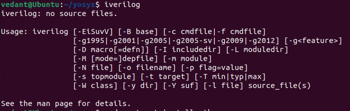


## GTKWave
```
sudo apt-get update
sudo apt install gtkwave 
```

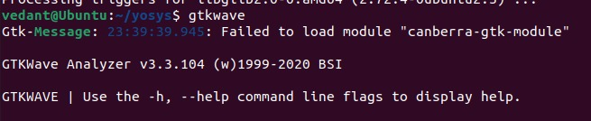
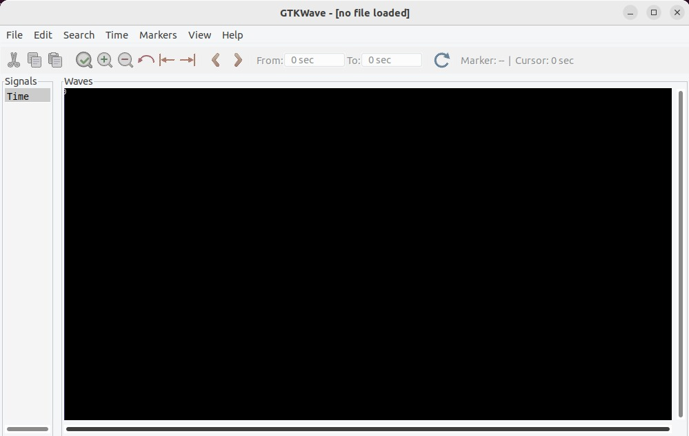


</details>

# WEEK 1
<details>
<summary><b> Day 1 - Introduction to Verilog RTL Design and Synthesis</b></summary>

## Introduction to open-source simulator Iverilog

RTL design is simulated to check for its adherence wrt to the spec. To simulate we use Iverilog.

We use a testbench to instantiate the values for the Verilog code variables which is given as input to check for both the verilog code simulation as well as for the netlist.

Folder structure of the git clone:

- `lib` - contains sky130 standard cell library
- `my_lib/verilog_models` - contains all the standard cells verilog model
- `verilog_files` - contains the lab experiments source files

Command to run the design and testbench

```
iverilog good_mux.v tb_good_mux.v
```

Output of iverilog is vcd file which is given as input to gtkwave. A a.out file is created, executing which the iverilog dumps the vcd file.

## Introduction to GTKWave

gtkwave is used to display the waveforms, giving the vcd file as the input.

Command to view the vcd file in gtkwave

```
./a.out
gtkwave tb_good_mux.vcd
```
The image below shows the waveform generated.
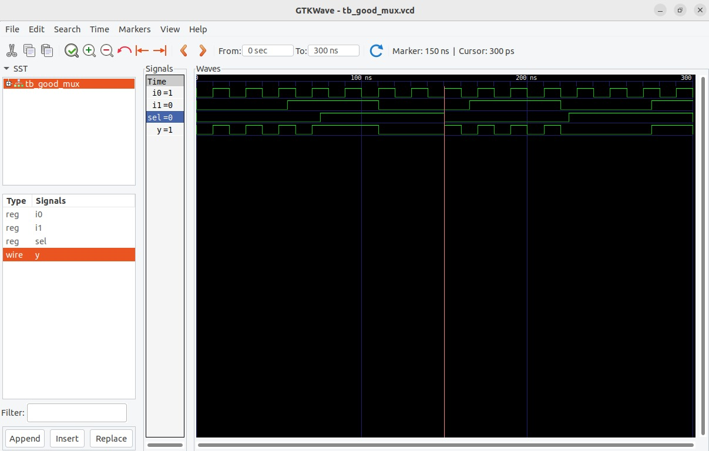


## Introduction to Yosys

Yosys is a synthesizer which converts the RTL code to gate-level netlist. The verilog code along with the lib file are the inputs given to it, which then generates the gate-level netlist as the output.

## Using Yosys Sky130 PDKs and verilog codes

The images below show the hierarchy of the commands used to generate the netlist. It starts with syntax checking and analysing the verilog code and mapping it to general gates. Then we map the boolean logic to standard cells from the .lib file.

Be in the verilog_codes directory and follow the below commands

```
yosys
read_liberty -lib ../lib/sky130_fd_sc_hd__tt_025C_1v80.lib
read_verilog good_mux.v
synth -top good_mux.v
abc -liberty ../lib/sky130_fd_sc_hd__tt_025C_1v80.lib
show
```

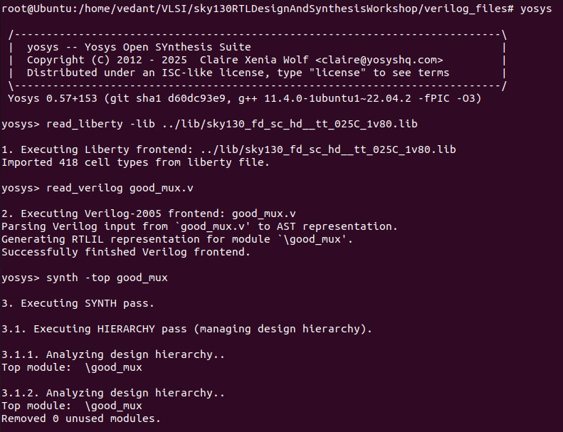
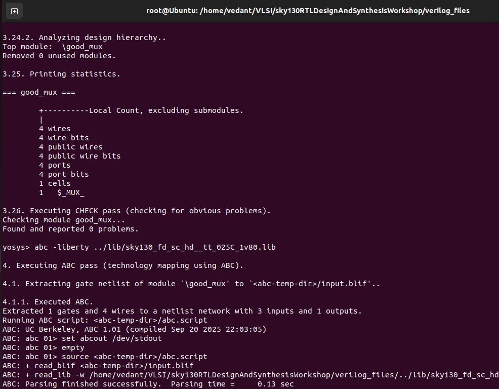
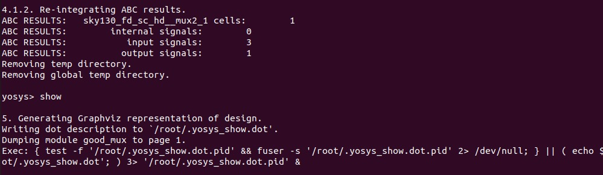


The below image shows the generated netlist as the output of the synthesis procedure and to do that follow the below code.

```
write_verilog <module_name>
!vim <module_name>
```

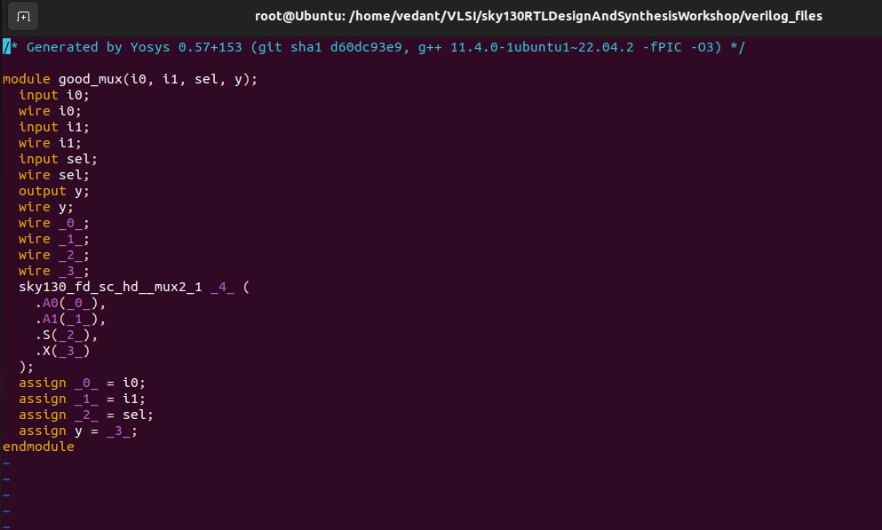

</details>


<details>
<summary><b> Day 2 - Timing libs, Hierarchical vs Flat Synthesis and Efficient Flop Coding Styles</b></summary>

## Introduction to timing .lib

Libraries are defined on the basis of PVT contraints (P-process, V-voltage, T-temperature).

The below image shows the PVT constraints:
- tt stands for typical in the .lib name
- 025C stands for temperature of 25 C in the .lib name
- 1v80 stands for voltage of 1.8V in the .lib name

```
!vim ../lib/sky130_fd_sc_hd__tt_025C_1v80.lib
```

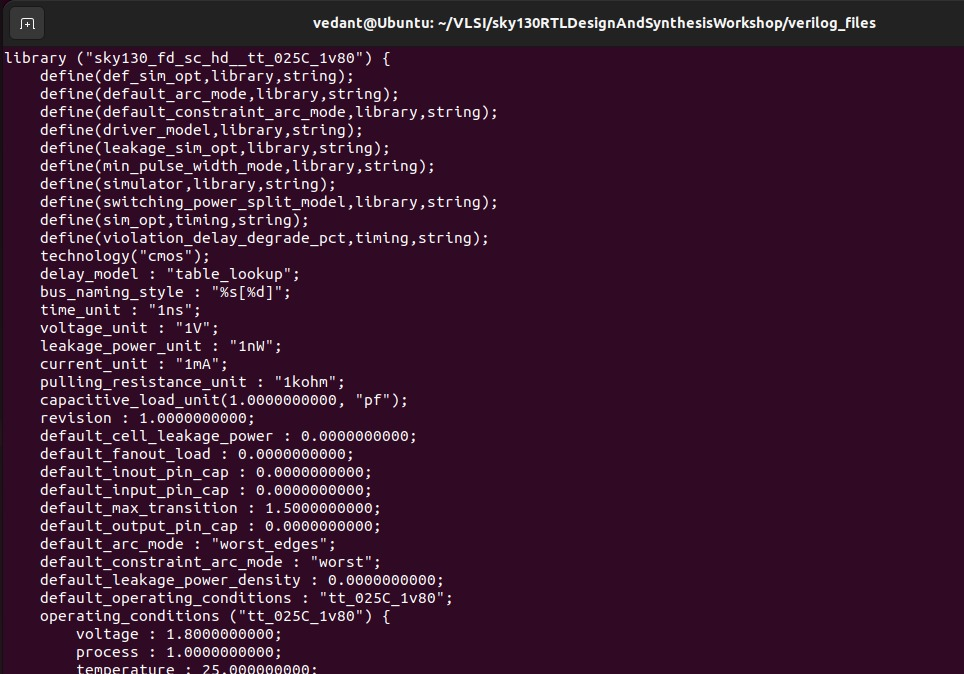

'-cell' marks the start of the cell. It consists of different characteristics of the cell as mentioned below:
- Area
- Power associated with pin
- Width
- Delay
- Input capacitance
- Transition

Same cell(same logic functionality) will have different types, having different characteristics in terms of area and other parameters.

## Hierarchical vs Flat Synthesis

### Hierarchical Synthesis

The image below shows the report of synthesising the multiple_modules.v. The code has both the sub-modules instantiated.

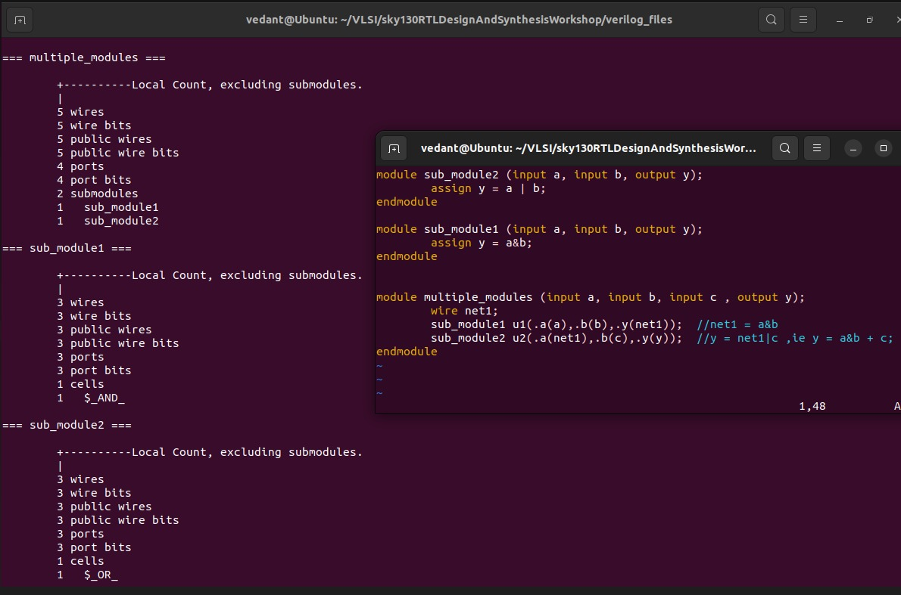

We can see both the sub-modules- the And gate and the Or gate have been instantiated differently. Rather than seeing AND or OR gate, we see sub_modules when we run the command 'show' as shown in the screenshot. Basically, the hierarchy is preserved. This is an example of Hierarchical Synthesis.

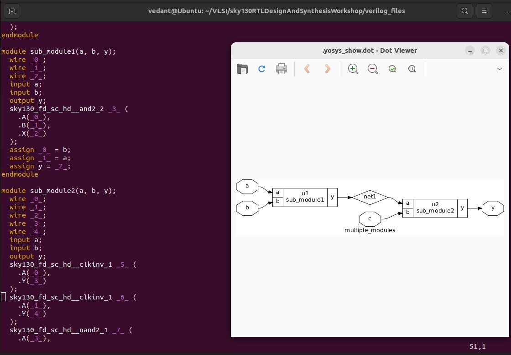

If we look into the sub_module2 in synthesized netlist 'multiple_modules_hier.v', we see that rather than OR gate, the inputs a & b, pass through the inverter and then NAND gate. It is because in CMOS, stacking PMOS, which happens in 'OR' gate is bad as PMOS has lower mobility than NMOS, which is stacked in NAND gate, and always have to be wider to get some meaningful output. One can also say that the charing and dishcharging is faster in a NANd gate compared to NOR or other gates. The next step is to check .lib file for the answer.


### Flat Synthesis

The design can be flattened by using the command `flatten`.

The image below shows the code along with the generated netlist and the logical diagram output. Here one can see that the submodules aren not instantiated. Rather the gates have been instantiated in the logical diagram along with the module names. This proves that flattening has broken down the hierarchy.

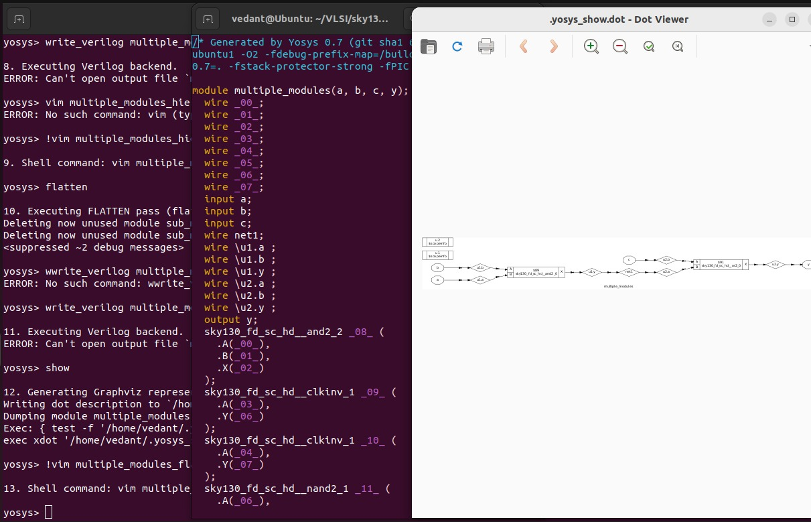


### Sub-module Level Synthesis

RTL (Register Transfer Level) designs are often modular, with various functional blocks or sub-modules. Sub-module level synthesis allows each of these sub-modules to be synthesized independently.

Sub-module level synthesis is necessary for the following reasons:-
- Optimization and Area Reduction: By synthesizing sub-modules separately, the synthesis tool can optimize each one individually. It performs logic optimization, technology mapping, and area minimization for each sub-module. This leads to more efficient use of resources and reduced overall chip area.
- Reusability: When we have multiple instances of the same module, synthesizing one will save resources and time.
- Parallel Processing: To divide and conquer i.e. it is more efficient to synthesise each module concurrently when the design is massive. It helps reduce the TAT.

The commands to run sub-module synthesis:

```
read_liberty -lib ../lib/sky130_fd_sc_hd__tt_025C_1v80.lib
read_verilog multiple_modules.v
synth -top sub_module1
abc -liberty ../lib/sky130_fd_sc_hd__tt_025C_1v80.lib
show
```

The image below shows the synthesis of the sub-module1. 

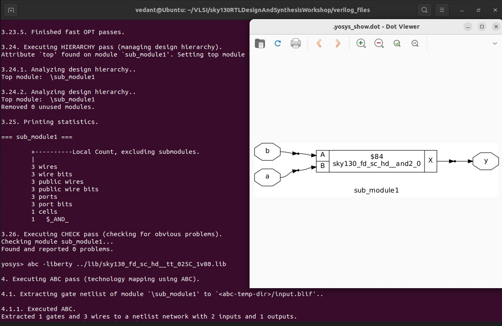


## Various Flop Coding Styles and Optimization

### How to prevent glitches in the circuit? How do flip-flops help here?

Glitches can occur in digital circuits due to various reasons such as signal delays, noise, or timing issues. Flops prevent glitches during the operation in the following ways:

- Synchronization: Flops are edge-triggered devices, meaning they respond only to transitions of the input signal (e.g., rising edge, falling edge). This synchronization ensures that the output changes only at specific points, reducing the likelihood of glitches caused by transient signal variations.
- Timing Control: Flops are typically controlled by a clock signal, ensuring that all circuit operations occur synchronously. This eliminates timing issues that could lead to glitches due to data arriving at different times.


### Different types of FLops:

The type of flop changes on the basis of the set-reset signals and their usage.

The image below shows the codes of different type of flops.

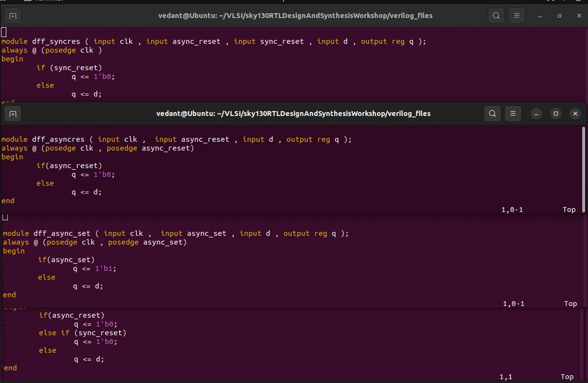

The image below shows DFF with asynchronous reset HDL simulation in Iverilog and waveform display in GTKwave. Irrespective of the clock and d, as soon as async_reset=1, q=0.

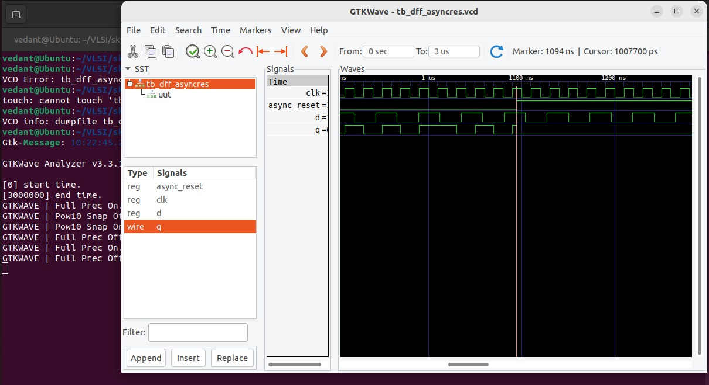

The image below shows DFF with asynchronous set HDL simulation in Iverilog and waveform display in GTKwave. Irrespective of the clock and d, as soon as async_set=1, q=1.

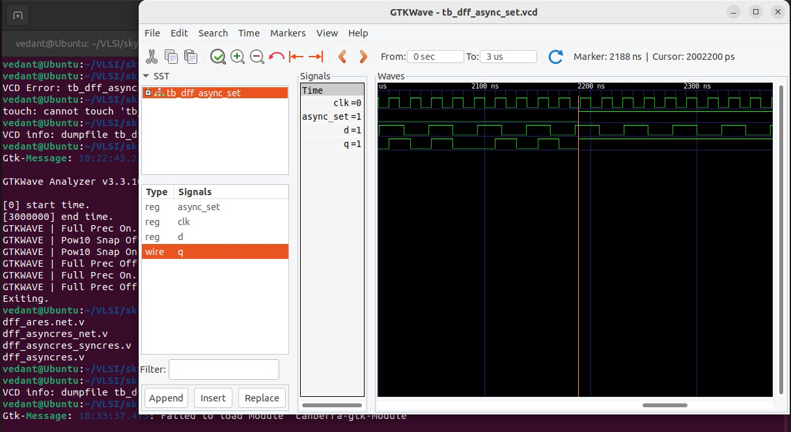

### Synthesis of Flops

Below are the commands to synthesize DFF with asynchronous reset.
```
read_liberty -lib ../lib/sky130_fd_sc_hd__tt_025C_1v80.lib
read_verilog dff_asyncres.v
synth -top dff_asyncres
dfflibmap -liberty ../lib/sky130_fd_sc_hd__tt_025C_1v80.lib
abc -liberty ../lib/sky130_fd_sc_hd__tt_025C_1v80.lib
show
```

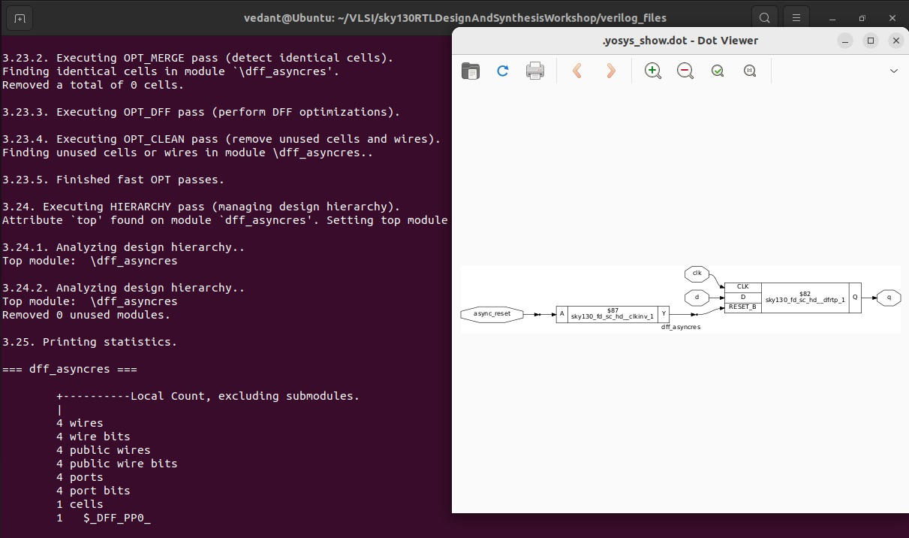

On synthesizing DFF with synchronous reset we get NOR gate with inverted d as shown in the image below. However, on evaluating the boolean expression, we reach the same logic realization. 
The flow of commands remains the same. Just have to change the name of the file accordingly.

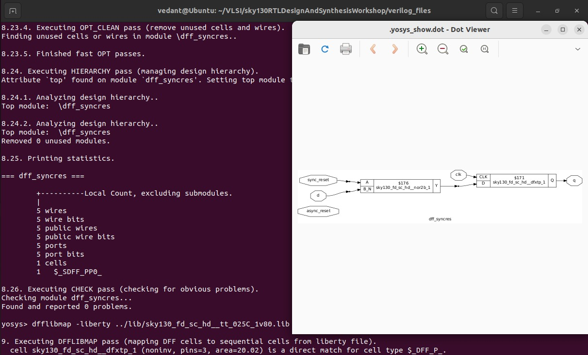

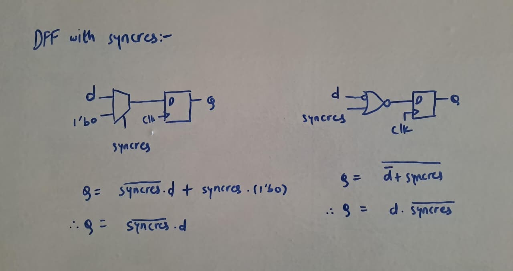


## Synthesizing mult2 (multiply by 2)

To implement `y[3:0] = 2*a[2:0]`, we append a `1'b0` to the `a[2:0]` i.e, `y[3:0] = {a[2:0],0}`. This is also equal to left shift the input bits by 1. This can be realized by just wiring. So we expect no hardware which is also seen in the screenshot below, analysis after synthesis and show. The command 'abc' is not required for mapping when there are no cells.

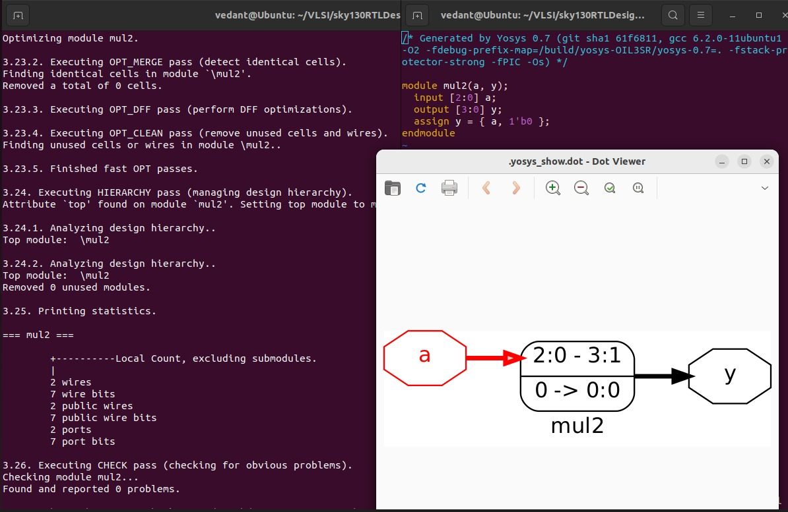

## Synthesizing mult9 (multiply by 9)

`y=9*a` can be considered `8*a+1*a` To implement `y[5:0] = 9*a[2:0]`, we append 000 to a[2:0] and then add a i.e, `y[5:0] = {a[2:0],000} + a[2:0]`. This can be realized just by wiring. So we expect no hardware which is also seen in the screenshot below, analysis after synthesis and show. The command 'abc' is not required for mapping when there are no cells.


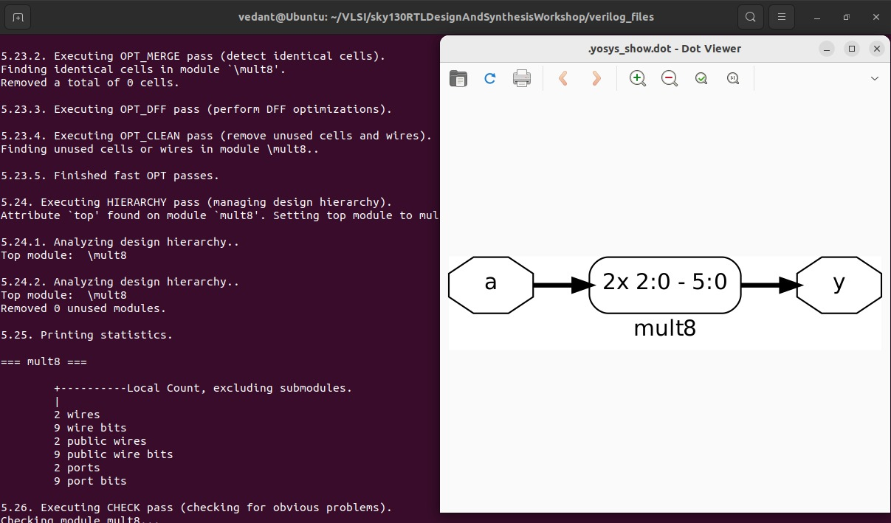

The multiply by 2 and multiply by 9 are special cases of synthesis, which post synthesis donot use any registers.
</details>


<details>
<summary><b> Day 3 - Combinational and Sequential Optimizations</b></summary>

## Introduction to Optimizations

### Combinational Logic Optimization

It means squeezing the logic to get the most optimized design in terms of area and power. the most commonly used techniques are:
- Constant propagation using direct optimization
- Boolean logic optimization using K-map(<5 variables) and Quine McKlusky(>5 variables)

The image below is an example of constant propogation.

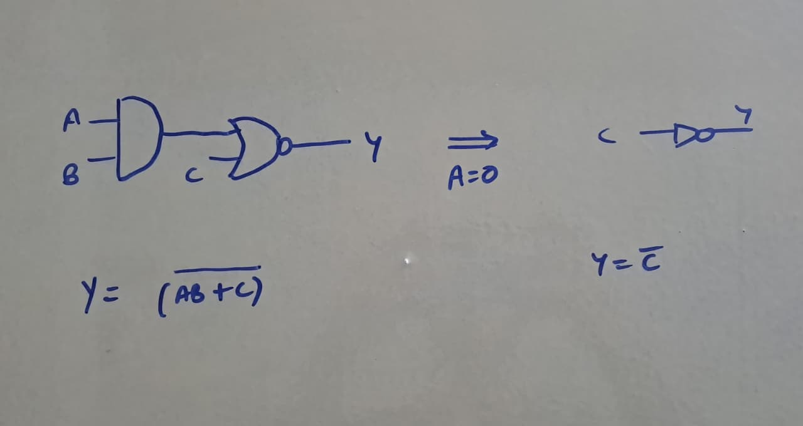

The image below is an example of boolean logic optimization.

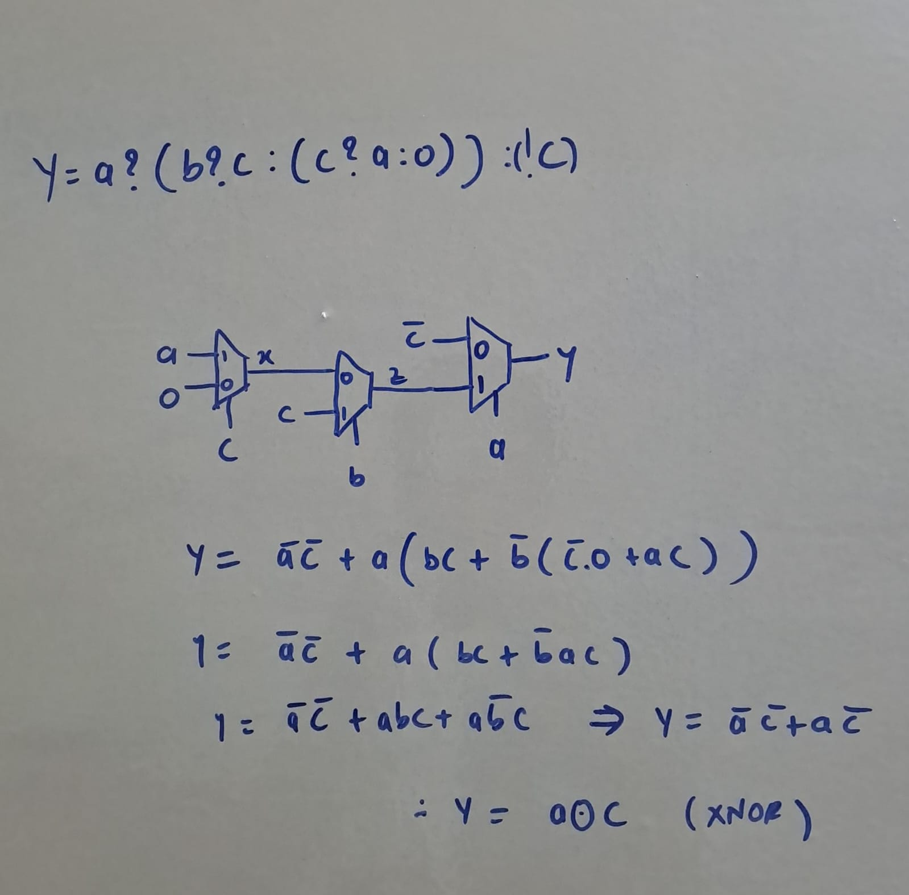


### Sequential Logic Optimization

The technqiues used are:

1) Basic
- Sequential constant propagation
2) Advanced 
- Static optimization
- Retiming
- Sequential logic cloning (floorplan aware synthesis)

An example of sequential constant propagation is of DFF with asynchronous reset where D input is grounded. Here one can just conclude `y = 1`. 

To note, the same technique cannot be applied to DFF with the asynchronous set because while `Q=1` when `Set=1`, but `Q=0` at `Set=0` at the next CLK pulse. Q is dependent not only on Set but also on the clock edge.

Retiming is a technique to improve the performance of the circuit. Here one can switch the logical implementation circuit between FFs to next/prior set of FFs in order to increase the performance of the circuit.


## Combinational Logic Optimizations

Command used for optimization:
```
opt_clean -purge
```

### Optimization of opt_check.v

Code
```
module opt_check (input a , input b , output y);
        assign y = a?b:0;
endmodule
```

For opt_check.v the assignment `y = a?b:0` reduces to `y = ab`. 

The logic implementation after synthesis for opt_check.v is shown below, showing only AND gate.

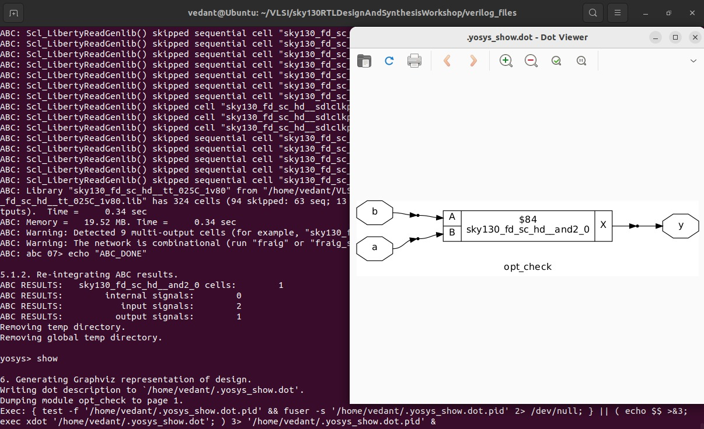


### Optimization of opt_check2.v

Code
```
module opt_check2 (input a , input b , output y);
        assign y = a?1:b;
endmodule
```

For opt_check2.v the assignment `y = a?1:b` reduces to `y = a+b`. 

The logic implementation after synthesis for opt_check2.v is shown below, showing only OR gate.

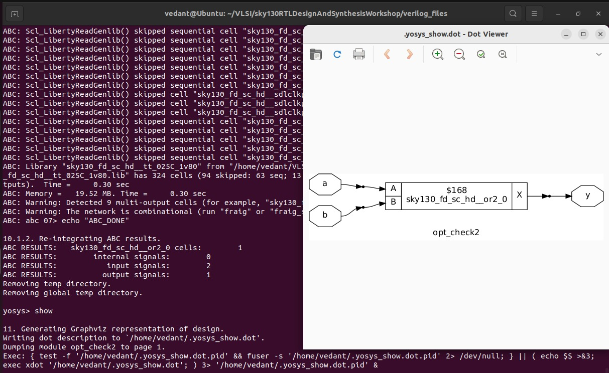


### Optimization of opt_check3.v

Code
```
module opt_check3 (input a , input b, input c , output y);
	       assign y = a?(c?b:0):0;
endmodule
```

For opt_check3.v the assignment `y = a?(c?b:0):0` reduces to `y = a+b`. 

The logic implementation after synthesis for opt_check3.v is shown below, showing 3 input AND gate.

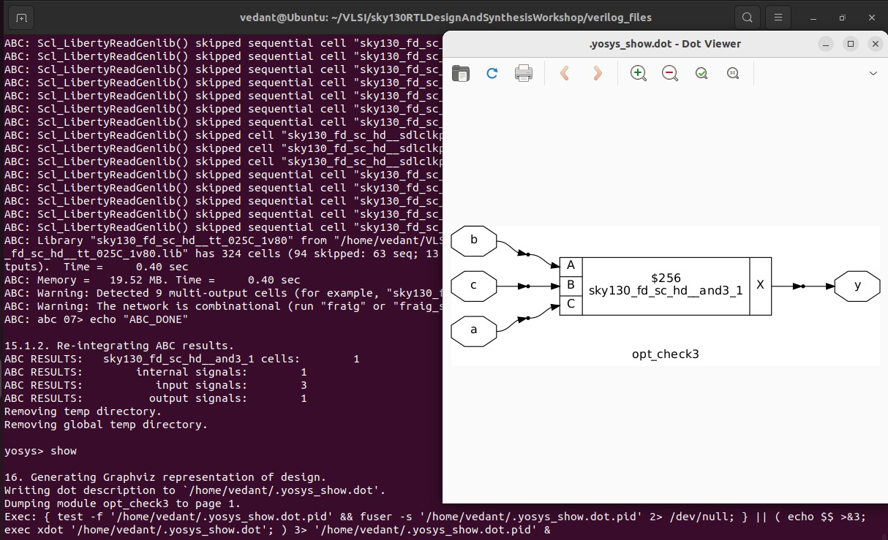


### Optimization of opt_check4.v

Code
```
module opt_check3 (input a , input b, input c , output y);
	       assign y = a?(b?c:(c?a:0)):(!c);
endmodule
```

For opt_check4.v the assignment `y = a?(b?c:(c?a:0)):(!c)` reduces to `y = a xnor b`. 

The logic implementation after synthesis for opt_check4.v is shown below, showing 3 input AND gate.

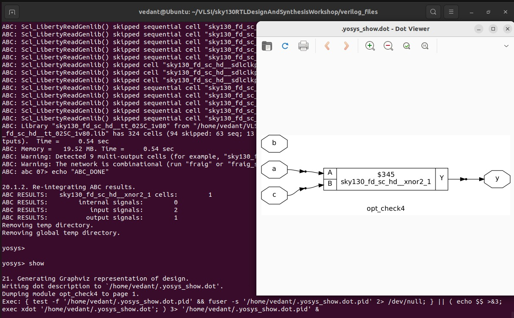


### Optimization of multiple_module_opt.v

Code
```
module sub_module1(input a , input b , output y);
 assign y = a & b;
endmodule

module sub_module2(input a , input b , output y);
 assign y = a^b;
endmodule

module multiple_module_opt(input a , input b , input c , input d , output y);
wire n1,n2,n3;

sub_module1 U1 (.a(a) , .b(1'b1) , .y(n1));
sub_module2 U2 (.a(n1), .b(1'b0) , .y(n2));
sub_module2 U3 (.a(b), .b(d) , .y(n3));

assign y = c | (b & n1); 
endmodule
```

For multiple_module_opt.v the boolean logic reduces to `y = c | (a & b)`. 

The logic implementation after synthesis for multiple_module_opt.v is shown below.

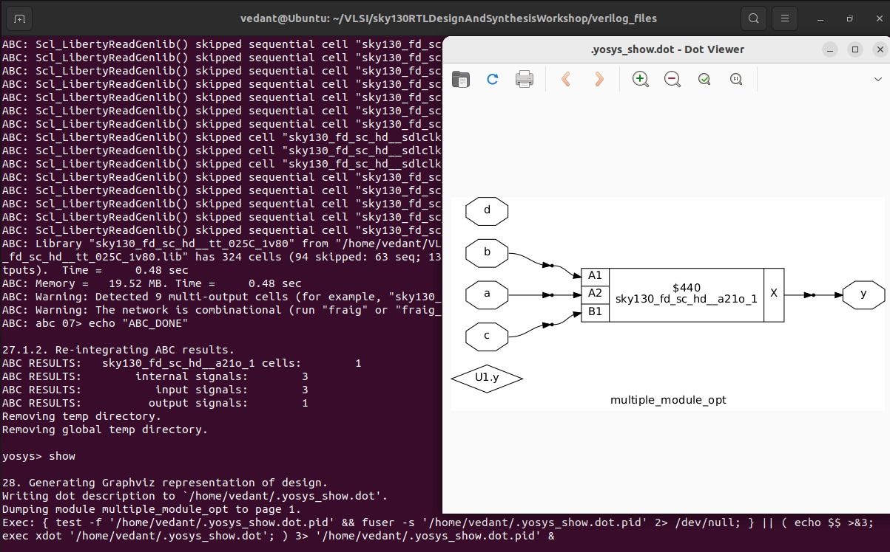


### Optimization of multiple_module_opt2.v

Code
```
module sub_module1(input a , input b , output y);
 assign y = a & b;
endmodule

module multiple_module_opt(input a , input b , input c , input d , output y);
wire n1,n2,n3;

sub_module1 U1 (.a(a) , .b(1'b0) , .y(n1));
sub_module1 U2 (.a(b), .b(c) , .y(n2));
sub_module1 U3 (.a(n2), .b(d) , .y(n3));
sub_module1 U4 (.a(n3), .b(n1) , .y(y));

endmodule
```

For multiple_module_opt.v the boolean logic reduces to `y = 1'b0`. 

The logic implementation after synthesis for multiple_module_opt.v is shown below.

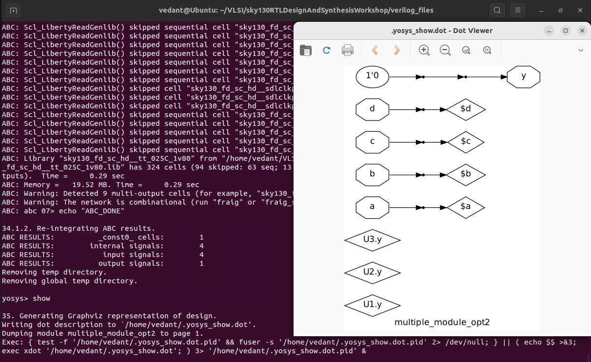


## Sequential Logic Optimizations

### Optimizing dff_const1.v

Code
```
module dff_const1(input clk, input reset, output reg q);
always @(posedge clk, posedge reset)
begin
	if(reset)
		q <= 1'b0;
	else
		q <= 1'b1;
end

endmodule
```

For dff_const1.v, `q=0` as long as `reset=1`. However, when `reset=0` `q` doesn't immediately becomes `1` rather at the next rising edge of the clk as shown below. So the optimization cannot be applied. 

The image below shows the gtkwave output and the code to run the gtkwave is the same as before.

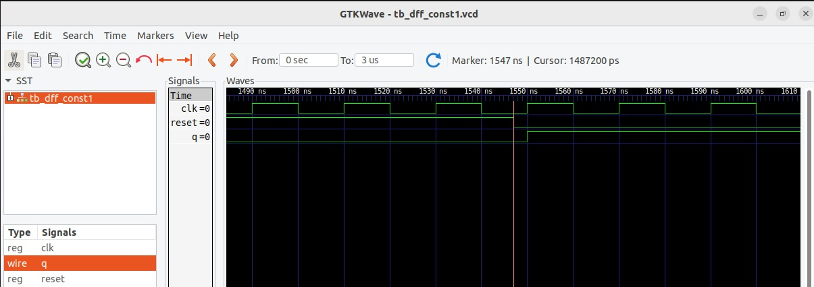

Below are the commmands to run synthesis.

```
read_liberty -lib ../lib/sky130_fd_sc_hd__tt_025C_1v80.lib
read_verilog dff_const1.v
synth -top dff_const1
dfflibmap -liberty ../lib/sky130_fd_sc_hd__tt_025C_1v80.lib
abc -liberty ../lib/sky130_fd_sc_hd__tt_025C_1v80.lib
show
```

The logic implementation after synthesis for dff_const1.v is shown below.

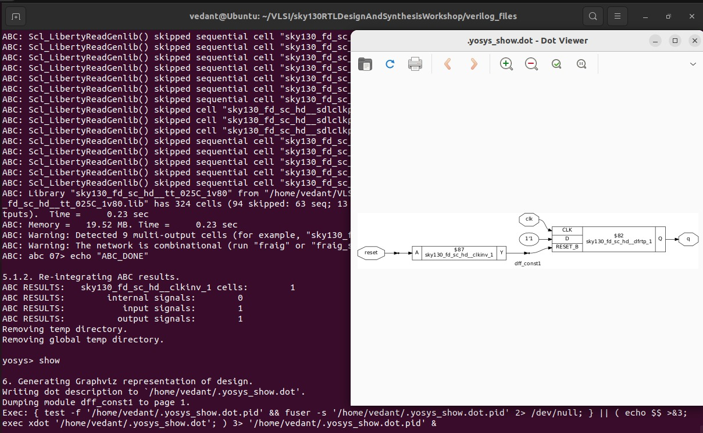


### Optimizing dff_const2.v

Code
```
module dff_const2(input clk, input reset, output reg q);
always @(posedge clk, posedge reset)
begin
	if(reset)
		q <= 1'b1;
	else
		q <= 1'b1;
end

endmodule
```

For dff_const2.v, `q=1` as long as `reset=1` and `q=1` even `if reset=0`. So the optimization is applied.

Below are the commmands to run synthesis.

```
read_liberty -lib ../lib/sky130_fd_sc_hd__tt_025C_1v80.lib
read_verilog dff_const2.v
synth -top dff_const2
dfflibmap -liberty ../lib/sky130_fd_sc_hd__tt_025C_1v80.lib
abc -liberty ../lib/sky130_fd_sc_hd__tt_025C_1v80.lib
show
```

The logic implementation after synthesis for dff_const2.v is shown below.

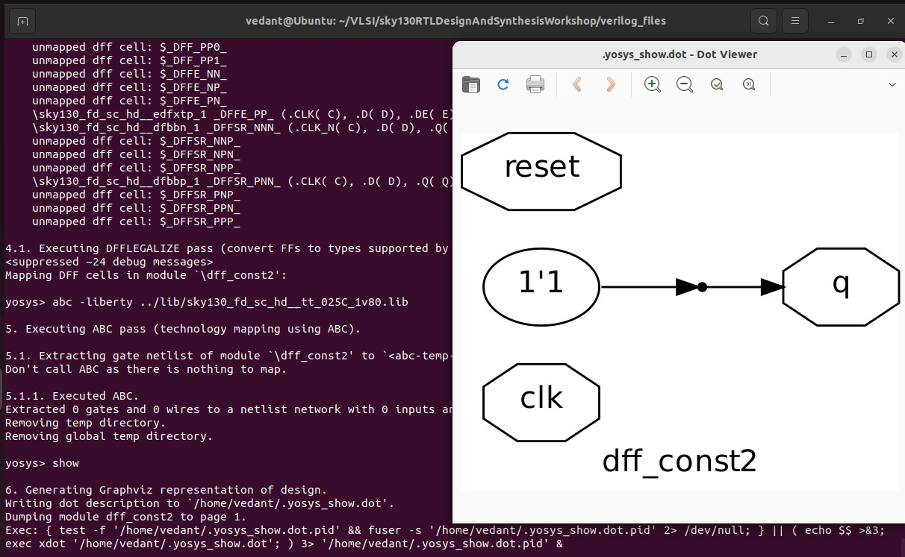


### Optimizing dff_const3.v

Code
```
module dff_const3(input clk, input reset, output reg q);
reg q1;

always @(posedge clk, posedge reset)
begin
	if(reset)
	begin
		q <= 1'b1;
		q1 <= 1'b0;
	end
	else
	begin
		q1 <= 1'b1;
		q <= q1;
	end
end

endmodule
```

For dff_const3.v, there are two flops. `q1=0` as long as `reset=1`. However, when `reset=0` `q1` doesn't immediately become `1`, rather at the next rising edge of the clk with some propagation delay as shown below. `q=1` as long as `reset=1`, acting as set rather than reset. However, when `reset=0`, `q` samples `q1` as `0` as there are some propagation delay for q1as shown below. At the next clk edge `q` samples `q1` as `1`. So the optimization cannot be applied.

The image below shows the gtkwave output and the code to run the gtkwave is the same as before.

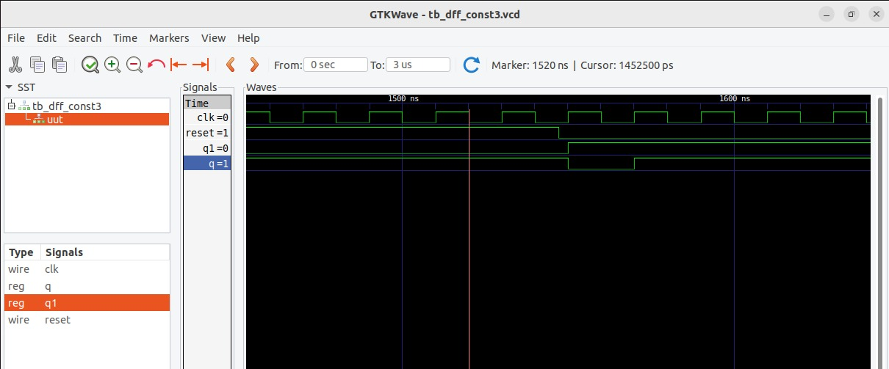

Below are the commmands to run synthesis.

```
read_liberty -lib ../lib/sky130_fd_sc_hd__tt_025C_1v80.lib
read_verilog dff_const3.v
synth -top dff_const3
dfflibmap -liberty ../lib/sky130_fd_sc_hd__tt_025C_1v80.lib
abc -liberty ../lib/sky130_fd_sc_hd__tt_025C_1v80.lib
show
```

The logic implementation after synthesis for dff_const3.v is shown below.

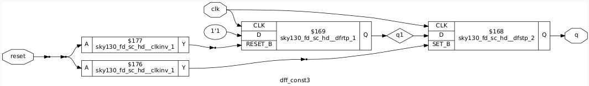


## Sequential Optimzations for Unused Outputs

### Optimization of Case1: 3-bit Up Counter with q[0] used (counter_opt.v)

Example of a counter where bits at the position of [2] and [1] are unused.

Code
```
module counter_opt (input clk , input reset , output q);
reg [2:0] count;
assign q = count[0];

always @(posedge clk ,posedge reset)
begin
	if(reset)
		count <= 3'b000;
	else
		count <= count + 1;
end

endmodule
```
The commands to run synthesis remain the same as done for the DFF modules.

We see only one flop after the synthesis and is also seen in synthesis report after `synth -top counter_opt.v`.


### Optimization of Case2: 3-bit Up Counter (counter_opt2.v)

Example of a counter where all bits are used.

Code
```
module counter_opt (input clk , input reset , output q);
reg [2:0] count;
assign q = (count[2:0] == 3'b100);

always @(posedge clk ,posedge reset)
begin
	if(reset)
		count <= 3'b000;
	else
		count <= count + 1;
end

endmodule
```
The commands to run synthesis remain the same as done for the DFF modules.

We see three flop after the synthesis and is also seen in synthesis report after `synth -top counter_opt.v`.

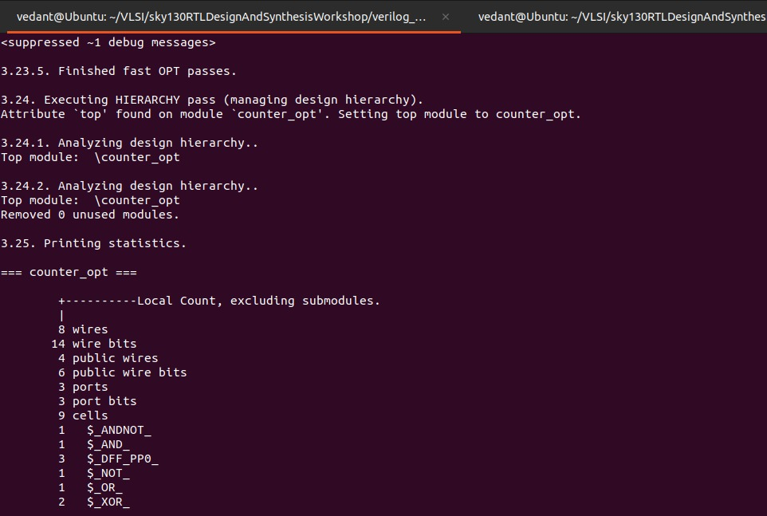

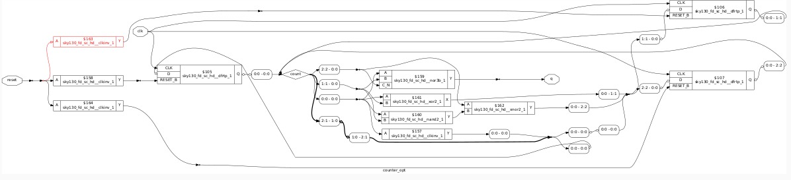

</details>


<details>
<summary><b> Day 4 - GLS, Blocking vs Non-blocking and Synthesis-Simulation Mismatch</b></summary>

## GLS, Synthesis-Simulation Mismatch, and Blocking/Non-blocking Statements

### Why is Gate Level Simulation (GLS) necessary?

- Verify the correctness of the design after synthesis
- Ensure the timing of the design is met which is done with delay annotation (timing aware)

So, essentially we are simulating the verilog file and the netlist file to ensure that the functionality is preserved. GTKwave is used to simulate the waveforms for both.


### Synthesis Simulation Mismatches
It happens because of the following reasons:
- Missing sensitivity list
- Blocking vs non-blocking assignments
- Non-standard verilog coding


(1) Missing sensitivity list

Consider 2 cases where one is trying to implement a mux. The inputs are `i0` and `i1`. In case one the sensitivity list contains `sel`, whereas the other contains `*`. For case-1 always block is evaluated only when `sel` is changing. So output `y` is not evaluated when `sel` is not changing although `i0` and `i1` are changing. Rather it acts like a latch as the output is latched onto the input `sel` changes. The case 2 represents the correct design coding for mux as its sensitive to sel and both inputs. In this case always is evaluated for any signal changes.


(2) Blocking vs Non-blocking Assignments

Blocking Statements
- Represented by `=`.
- Executes the statements in the order it is written inside always block.
- So the first statement is evaluated before the second statement.

Non-Blocking Statements
- Represented by `<=`.
- Executes all the RHS when always block is entered and assigns to LHS.
- Parallel execution.


Ex1:

The left side of the code below gives us the correct execution. While the right side can lead to serious issues as `d` is assigned to `q` directly. So choosing non-blocking statements is best practice.

```
module code_blocking (input clk, input reset,	 module code_blocking (input clk, input reset,	
                      input d,										  input d,					
                      output reg q);							      output reg q);			
  reg q0;											reg q0;										
  always @(posedge clk, posedge reset) begin		always @(posedge clk, posedge reset) begin	
    if (reset) begin								  if (reset) begin							
      q0 = 1'b0;										 q0 = 1'b0;								
      q  = 1'b0;										 q  = 1'b0;								
    end												  end											
    else begin										  else begin									
      q  = q0;   										 q0 = d;
      q0 = d;											 q  = q0;									
    end											      end
  end												 end
endmodule										 endmodule
```


Ex2:

Blocking Statements Leading to Synthesis Simulation Mismatch.

In the code shown below, `y` gets the old `q0` value. This will mimic delay or flop. But when you synthesize, there will be no flop. If the order is changed (right side code), latest value of `q0` is assigned to `y`.

When synthesized, both will lead to the same circuit. However, simulation will result in different behavior. For the left side of the code, `y` gets the old `q0` value and for the right side of the code, `y` gets the latest `q0` value leading to a synthesis simulation mismatch.

This issue is resolved by using non-blocking statements.

```
module code (input a, b, c,		 	module code (input a, b, c,					
             output reg y);						 output reg y);

  reg q0;							  reg q0;

  always @(*) begin					  always @(*) begin
    y  = q0 & c;   						q0 = a | b;
    q0 = a | b;   						y  = q0 & c;
  end								  end

endmodule						    endmodule

```


## Labs on GLS and Synthesis-Simulation Mismatch

### Ternary operator MUX (ternary_operator_mux.v)

Code
```
module ternary_operator_mux (input i0 , input i1 , input sel , output y);
	assign y = sel?i1:i0;
endmodule
```

Command to run the simulation using gtkwave remains the same, just change the verilog file names.

HDL Simulation waveform of ternary_operator_mux.v is shown in the image below.

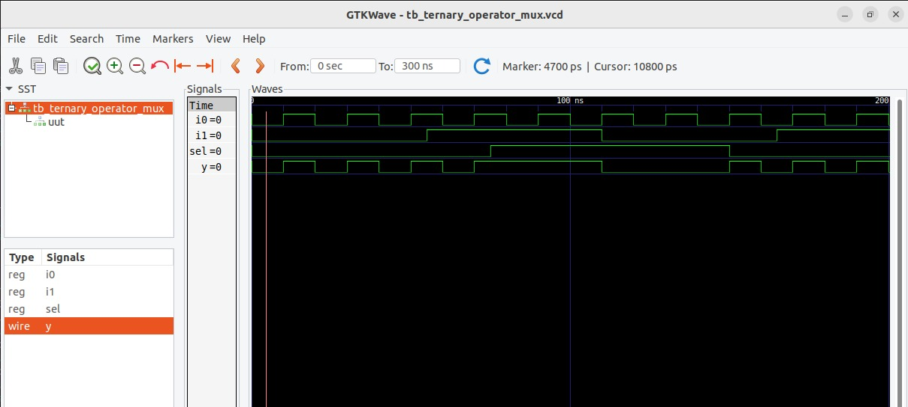

The commands to run the synthesis for ternary_operator_mux.v

```
read_liberty -lib ../lib/sky130_fd_sc_hd__tt_025C_1v80.lib
read_verilog ternary_operator_mux.v
synth -top ternary_operator_mux
abc -liberty ../lib/sky130_fd_sc_hd__tt_025C_1v80.lib
show
write_verilog ternary_operator_mux_net.v
```

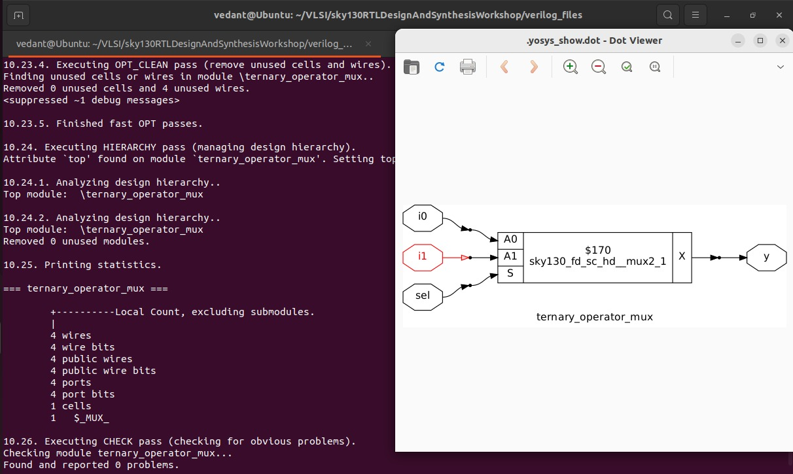

The commands to do GLS for ternary_operator_mux.v

```
iverilog ../my_lib/verilog_model/primitives.v ../my_lib/verilog_model/sky130_fd_sc_hd.v ternary_operator_mux_net.v tb_ternary_operator_mux.v
./a.out
gtkwave tb_ternary_operator_mux.vcd
```

The GLS output is shown below.

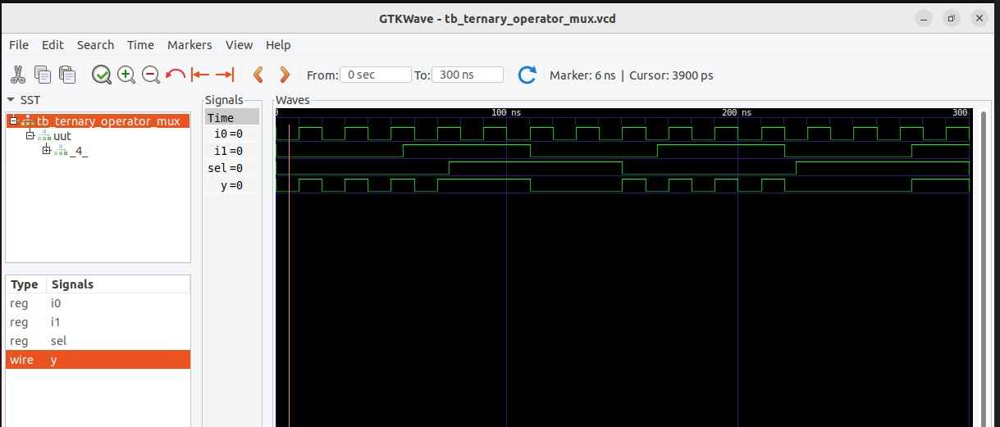


### Bad MUX (bad_mux.v)

The `always` block is executed only at `sel` signal. It works like a flop rather than mux. The Verilog code of bad_mux.v

Code
```
module bad_mux (input i0 , input i1 , input sel , output reg y);
always @ (sel)
begin
	if(sel)
		y <= i1;
	else 
		y <= i0;
end
endmodule
```

Command to run the simulation using gtkwave remains the same, just change the verilog file names.

HDL Simulation waveform of bad_mux.v is shown in the image below.

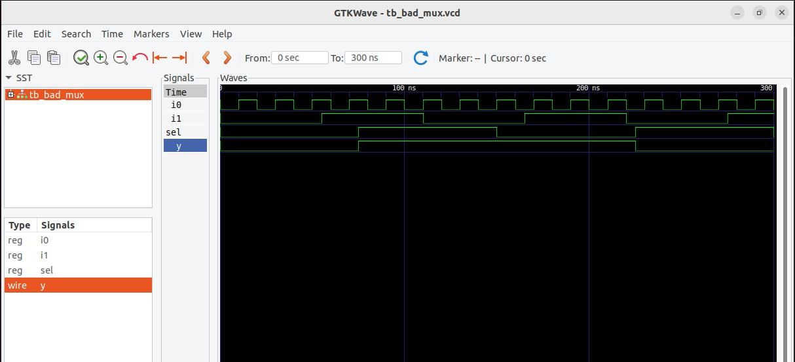

The commands to run the synthesis for bad_mux.v.

```
read_liberty -lib ../lib/sky130_fd_sc_hd__tt_025C_1v80.lib
read_verilog bad_mux.v
synth -top bad_mux
abc -liberty ../lib/sky130_fd_sc_hd__tt_025C_1v80.lib
show
write_verilog bad_mux_net.v
```

The synthesis report shows it is still inferring the mux but not the flop.

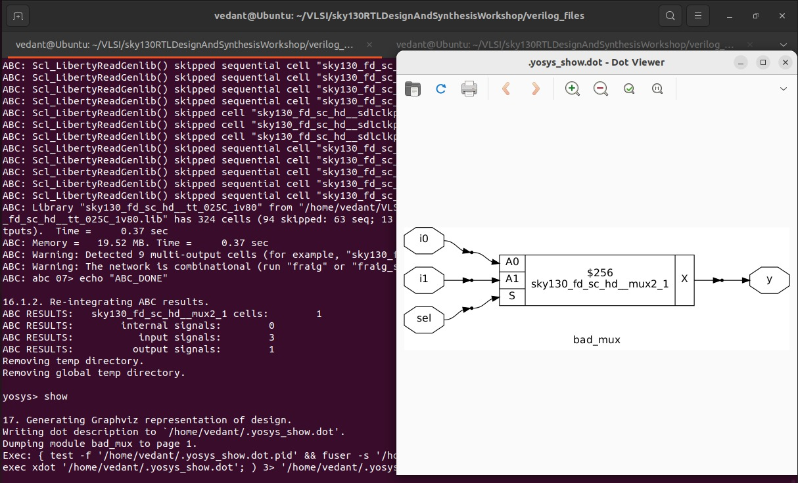

The commands to do GLS for bad_mux.v

```
iverilog ../my_lib/verilog_model/primitives.v ../my_lib/verilog_model/sky130_fd_sc_hd.v bad_mux_net.v tb_bad_mux.v
./a.out
gtkwave tb_bad_mux.vcd
```

The GLS output is shown below. This shows correct functionality which is different from HDL simulation, leading to synthesis simulation mismatch.

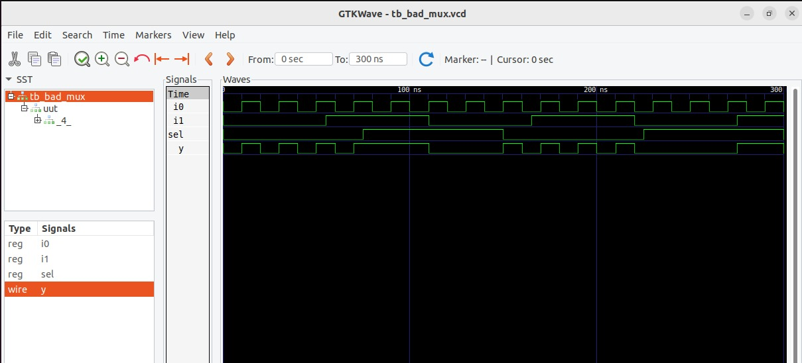


## Labs on Synthesis-Simulation Mismatch for Blocking Statements

### Blocking Caveat (blocking_caveat.v)

Code
```
module blocking_caveat (input a , input b , input  c, output reg d); 
reg x;
always @ (*)
begin
	d = x & c;
	x = a | b;
end
endmodule
```

Command to run the simulation using gtkwave remains the same, just change the verilog file names.

HDL Simulation waveform of blocking_caveat.v is shown in the screenshot below. `d` takes the old value of `x` causing incorrect functionality.

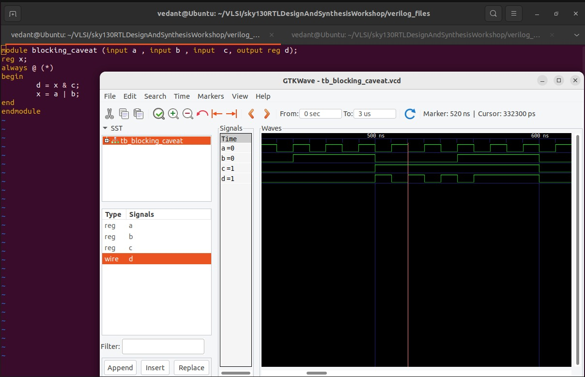

Below are the commands to run the synthesis for blocking_caveat.v.

```
read_liberty -lib ../lib/sky130_fd_sc_hd__tt_025C_1v80.lib
read_verilog blocking_caveat.v
synth -top blocking_caveat
abc -liberty ../lib/sky130_fd_sc_hd__tt_025C_1v80.lib
show
write_verilog blocking_caveat_net.v
```

The synthesis report and logic synthesis is shown below.

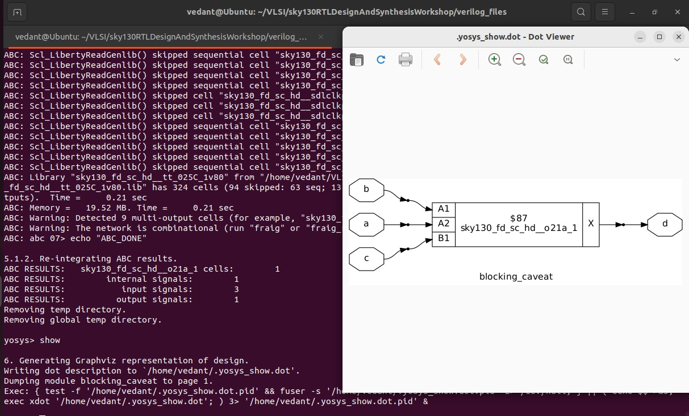

The commands to do GLS for blocking_caveat.v

```
iverilog ../my_lib/verilog_model/primitives.v ../my_lib/verilog_model/sky130_fd_sc_hd.v blocking_caveat_net.v tb_blocking_caveat.v
./a.out
gtkwave tb_blocking_caveat.vcd
```

The GLS output is shown below. In this case, `d` takes the current value of `x` causing incorrect functionality.The waveform shows correct functionality which is different from HDL simulation, leading to synthesis simulation mismatch.

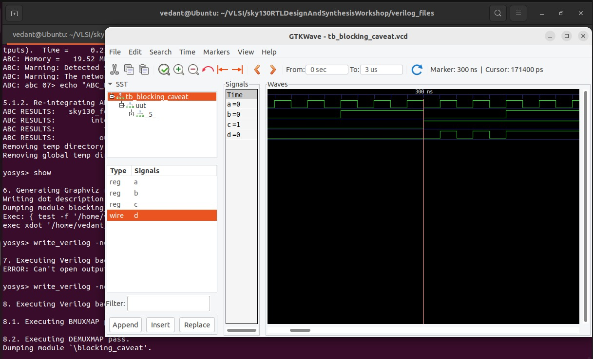

</details>


<details>
<summary><b> Day 5 - Optimization in Synthesis</b></summary>

## IF-ELSE statements

If all the cases have been mentioned using a `if-else` statement, it generates a priority encoder or a combination of muxes. It is used to create priority logic.

Code
```
if <cond 1>
	c1
else if <cond 2>
	c2
else
	c3
```

The image below shows the hardware that will be generated.

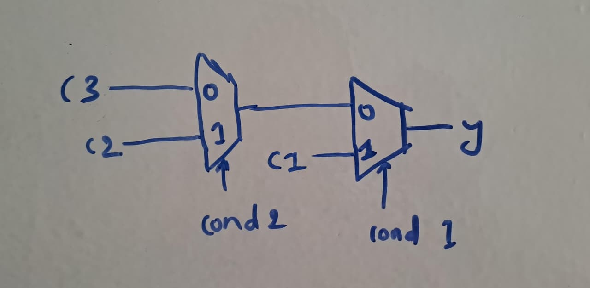


### Caveat in IF-ELSE statement

If one has just used `if`, `else-if` in the constrait without else statement, latch will be inferred.

Code
```
if <cond 1>
	c1
else if <cond 2>
	c2
```

The image below shows the hardware that will be inferred.

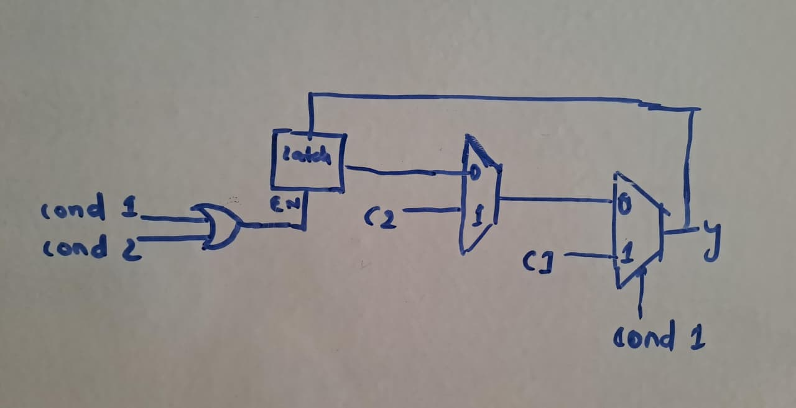


There might be exceptions to this like in case of designing a counter. If you dont mention the else statement, there will be a latch inferred, but would be logically correct as in that case when `en = 0`, the present value of `cout` will be latched/stored.

Code 
```
reg [2:0] count;
always @(posedge clk, posedge reset) begin
	if (reset)
		count <= 3'b000;
	else if (en)
		count <= count + 1;
end
```

So, essentially one must think of the hardware implementation before using the if-else statements and ensure that latches arent inferred unless necessary.


## CASE statements

If all cases have been covered in the case statement, then it results in a mux with number of cases as inputs and log2(#cases) as the select reg bit-size.

Code
```
case (sel) begin  #(sel is 2 bit reg)
2'b00 : x = a;
2'b01 : x = b;
2'b10 : x = c;
default : x = d;
end
```

The image below shows the hardware that will be generated.

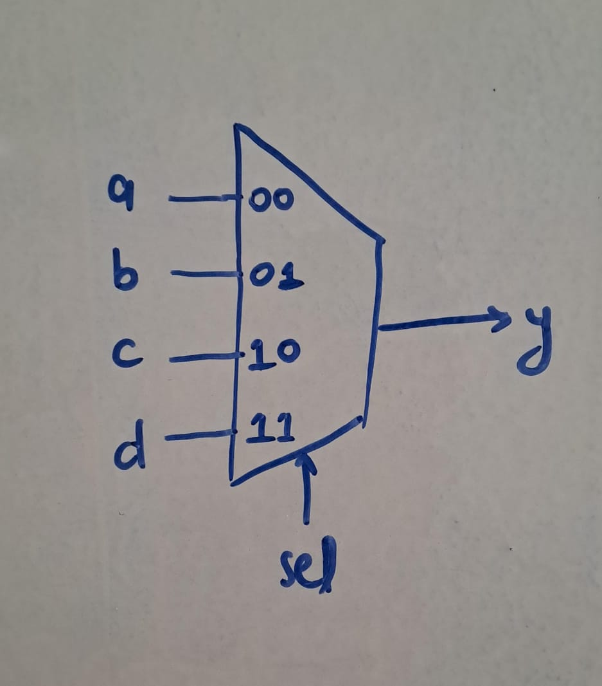


### Caveats in CASE statement

1) If no default is used when all cases are not mentioned, latch is inferred.

Code
```
case (sel) begin  #(sel is 2 bit reg)
2'b00 : x = a;
2'b01 : x = b;
2'b10 : x = c;  #(Here case 4 is not mentioned, hence latch will be inferred)
end
```

2) Partial assignment in case even after mentioning defaut case, also results in latch being inferred.

Code
```
case (sel) begin  #(sel is 2 bit reg)  #(Here 2 muxes will be inferred for reg x and y.)
2'b00 : x = a
		y = b;
2'b01 : x = b;  #(Here y is not assigned any value, hence latch will be inferred)
default: x = c
	     y = b;
end
```

3) Should not have overlapping case statements.

Code
```
case (sel) begin  #(sel is 2 bit reg)
2'b00 : x = a;
2'b01 : x = b;
2'b10 : x = c;
2'b1? : x = d;  #(Here case 10 and 1? both will get executed one after another and value will always be d at the end if sel = 10)
```


## Labs on Incomplete If

### Incomplete If-1 (incomp_if.v)

Code
```
module incomp_if (input i0, input i1, input i2, output reg y);
  always @ (*)
  begin
    if (i0)
      y <= i1;
  end
endmodule
```

The image below shows the simulation.

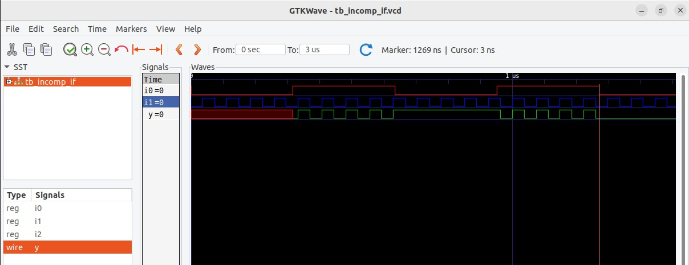

Commands to run synthesis.
```
read_liberty -lib ../lib/sky130_fd_sc_hd__tt_025C_1v80.lib
read_verilog incomp_if.v
synth -top incomp_if
abc -liberty ../lib/sky130_fd_sc_hd__tt_025C_1v80.lib
show
```

Latch is inferred, as else condition is not mentioned. The logic is independent of `i2`. The previous value of `i1`, before `i0 = 0` is latched to `y`.

The image below shows the output of synthesis.

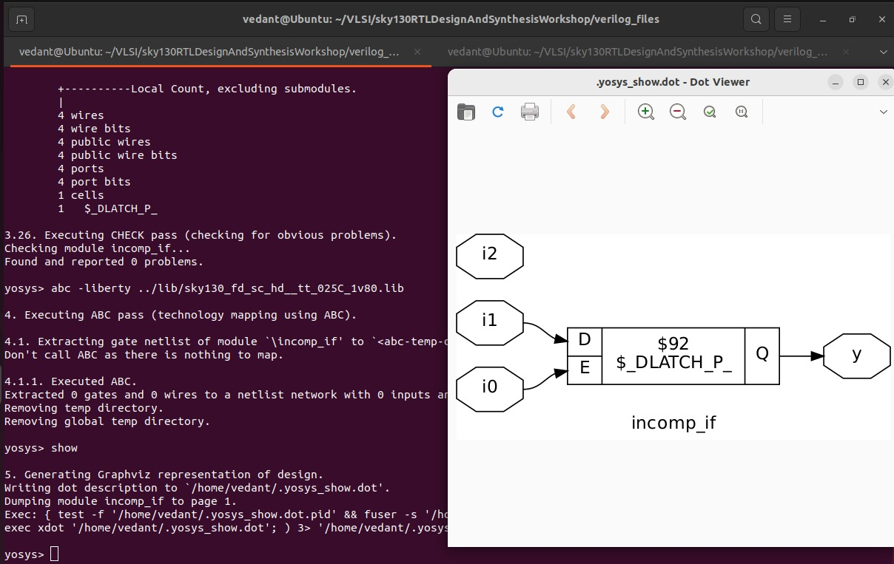


### Incomplete If-2 (incomp_if2.v)

Code
```
module incomp_if2 (input i0, input i1, input i2, input i3, output reg y);
  always @ (*)
  begin
    if (i0)
      y <= i1;
    else if (i2)
      y <= i3;
  end
endmodule
```

The image below shows the simulation.

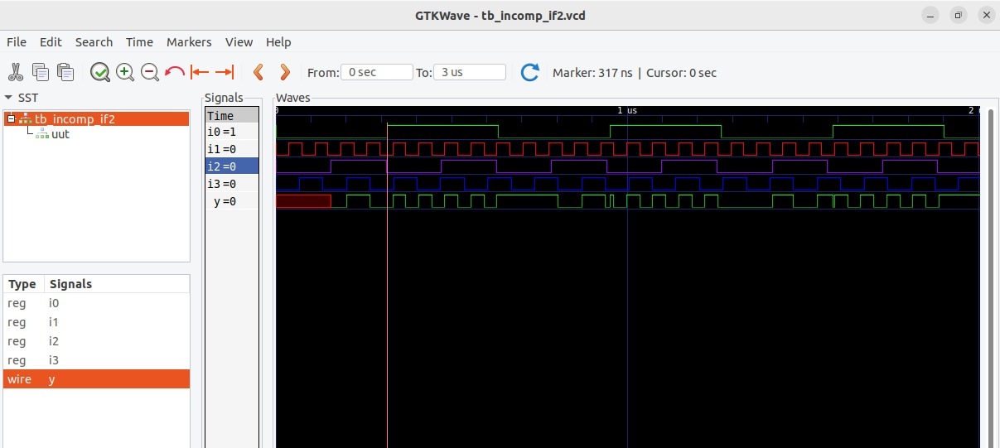

Commands to run synthesis.
```
read_liberty -lib ../lib/sky130_fd_sc_hd__tt_025C_1v80.lib
read_verilog incomp_if2.v
synth -top incomp_if2
abc -liberty ../lib/sky130_fd_sc_hd__tt_025C_1v80.lib
show
```

Latch is inferred, as else condition is not mentioned. The latch is enabled using `i0||i2`. NOR gate is used instead of OR for better optimization. The input to the latch is some combinational logic including `i0`,`i1`,`i3` with the help of a  mux.

The image below shows the output of synthesis.

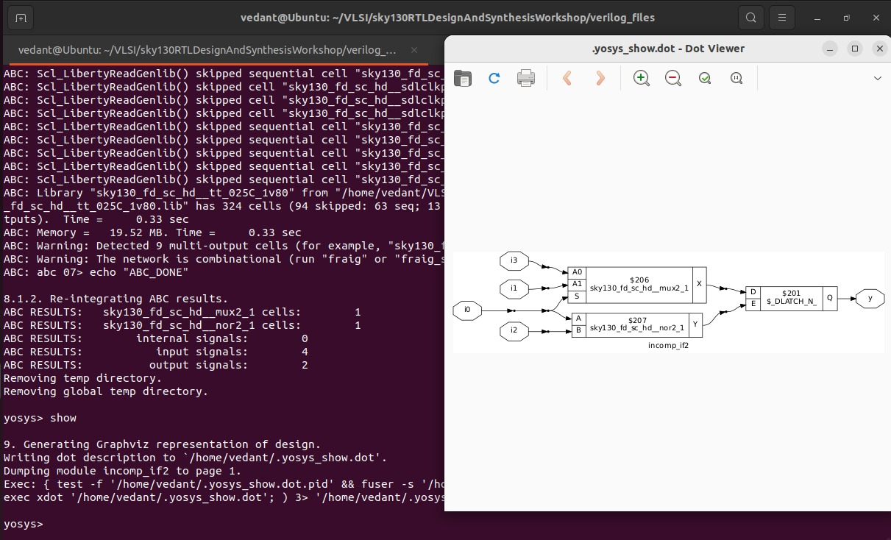


## Labs on Incomplete overlapping Case

### Incomplete case (incomp_case.v)

Code
```
module incomp_case (input i0, input i1, input i2, input [1:0] sel, output reg y);
  
  always @ (*) begin
    case (sel)
      2'b00: y = i0;
      2'b01: y = i1;
    endcase
  end

endmodule
```

The image below shows the simulation.

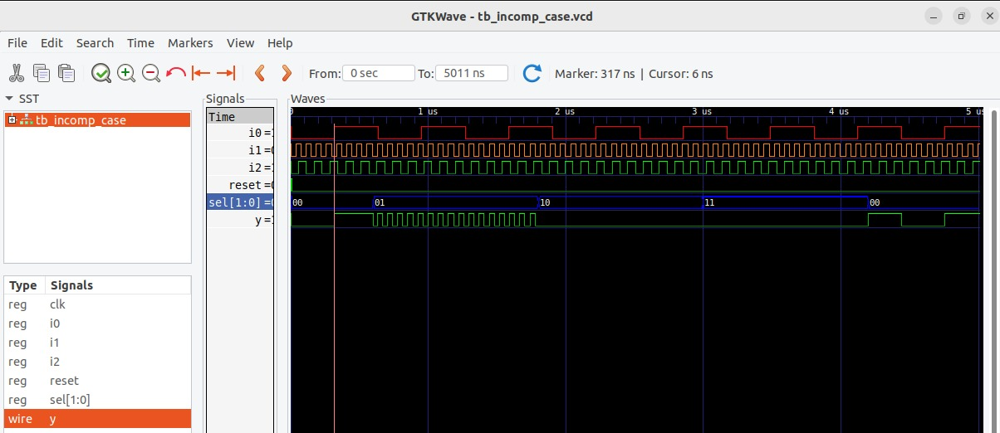

Commands to run synthesis.
```
read_liberty -lib ../lib/sky130_fd_sc_hd__tt_025C_1v80.lib
read_verilog incomp_case.v
synth -top incomp_case
abc -liberty ../lib/sky130_fd_sc_hd__tt_025C_1v80.lib
show
```

Latch is inferred for both the cases 2 and 3. The enable of the latch is `sel[1]` as its common for both cases. The input to the latch is the combinational logic between `i0` and `i1`. `i2` is not required at all. Mux is used to choose between `i0` and `i1`. 

The image below shows the synthesis output.

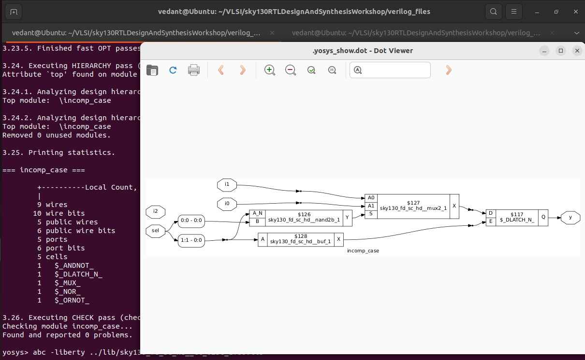


### Complete case (comp_case.v)

Code
```
module incomp_case (input i0, input i1, input i2, input [1:0] sel, output reg y);
  
  always @ (*) begin
    case (sel)
      2'b00: y = i0;
      2'b01: y = i1;
    endcase
  end

endmodule
```

The image below shows the simulation.

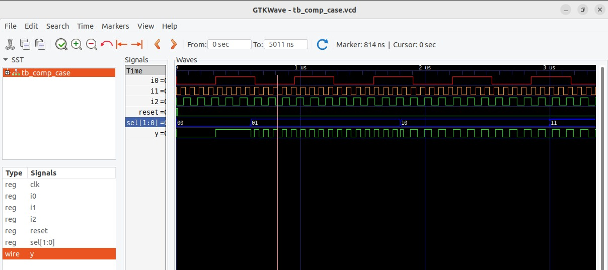

Commands to run synthesis.
```
read_liberty -lib ../lib/sky130_fd_sc_hd__tt_025C_1v80.lib
read_verilog comp_case.v
synth -top comp_case
abc -liberty ../lib/sky130_fd_sc_hd__tt_025C_1v80.lib
show
```

Latch is not inferred here as all cases are considered.
The image below shows the synthesis output.

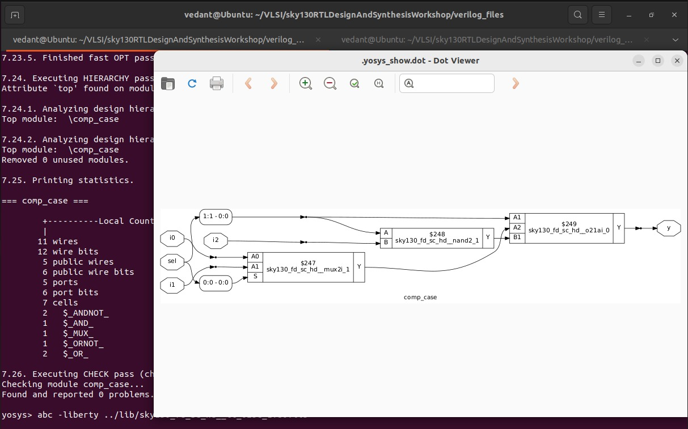


### Partial case (partial_case_assign.v)

Code
```
module partial_case_assign (input i0, input i1, input i2, input [1:0] sel, output reg y, output reg x);

  always @ (*) begin
    case (sel)
      2'b00: begin
        y = i0;
        x = i2;
      end
      2'b01: y = i1;
      default: begin
        x = i1;
        y = i2;
      end
    endcase
  end

endmodule

```

Commands to run synthesis.
```
read_liberty -lib ../lib/sky130_fd_sc_hd__tt_025C_1v80.lib
read_verilog partial_case_assign.v
synth -top partial_case_assign
abc -liberty ../lib/sky130_fd_sc_hd__tt_025C_1v80.lib
show
```

Latch is inferred here as one case does not assign value to `y`.  Mux is used to choose between i0 and i1 where `sel = sel1 + sel0'`
The image below shows the synthesis output.

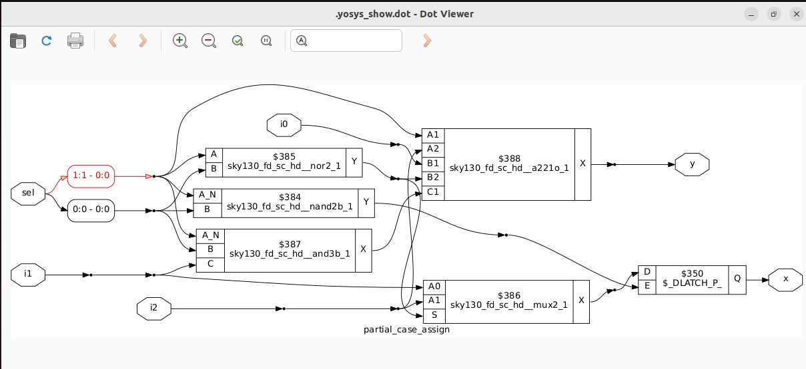


### Bad case (bad_case.v)

Code
```
module bad_case (input i0, input i1, input i2, input i3, input [1:0] sel, output reg y);

always @(*)
begin
    case (sel)
        2'b00: y = i0;
        2'b01: y = i1;
        2'b10: y = i2;
        2'b1?: y = i3;
    endcase
end

endmodule
```

For the case `2'b1?`, the tool gets confused and latches the output to `1'b1` until this case if finished. This leads to ambiguity.
The image below shows the simulation.

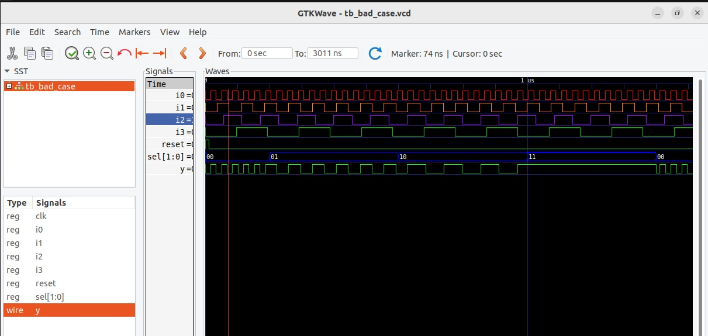

Commands to run synthesis.
```
read_liberty -lib ../lib/sky130_fd_sc_hd__tt_025C_1v80.lib
read_verilog bad_case.v
synth -top bad_case
abc -liberty ../lib/sky130_fd_sc_hd__tt_025C_1v80.lib
write_verilog bad_case_net.v
show
```

The image below shows the synthesis output. No latches will be inferred as all cases are covered, although overlap of cases is there.

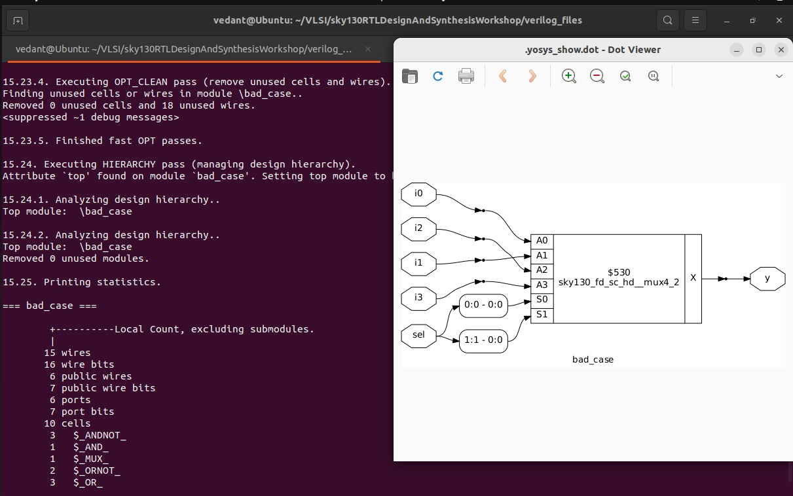

Command to run simulation for GLS.

```
iverilog ../my_lib/verilog_model/primitives.v ../my_lib/verilog_model/sky130_fd_sc_hd.v bad_case_net.v tb_bad_case.v
./a.out
gtkwave tb_bad_case.vcd
```

For the case `2'b1?`, the output follows `i3`. Conclusion is that the cases should be mutually exclusive to avoid ambuguity in the post synthesis and pre synthesis simulation.
Image below shows post synthesis simulation.

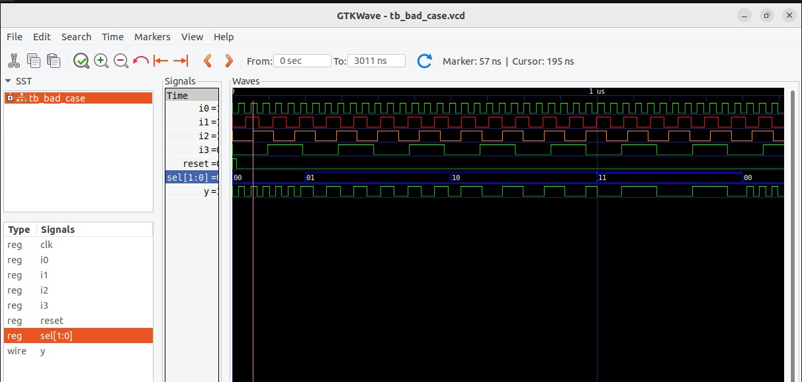


## For loop and For-Generate

### For loop 

Code
```
always @(*) begin
	MUX_OUT = 1'b0; 
	integer i; 
	for (i = 0; i < 32; i = i + 1) begin
		if (SELECT == i) begin
			MUX_OUT = DATA_IN[i];
		end
	end
end
```

Used inside `always` block for multiple evaluations. Like in the above code its used to produce a `32:1 mux` using blocking statements to ensure appropriate flow. Similarly, it can be used for other designs like demux, etc.


### For-Generate loop

Code
```
generate
	genvar i; 
	for (i = 0; i < N; i = i + 1) begin : bitwise_and_instance
		
		single_AND u_and (.a (A[i]), .b (B[i]), .y (Y_OUT[i]));
	end
endgenerate
```

Always used outside the `always` block. Its used to instantiate or replicate hardware. As in the above example its instantiating `N and` gates with inputs from `bus A and B`.
Same can be used for other purposed like Ripple Carry Adder, etc.


## Labs on For Loop

### Mux generation (mux_generate.v)

Code
```
module mux_generate (input i0, input i1, input i2, input i3, input [1:0] sel, output reg y);
    wire [3:0] i_int;
    assign i_int = {i3, i2, i1, i0}; 
    integer k; 
    
    always @ (*) begin
        y = 1'b0; 
        for (k = 0; k < 4; k = k + 1) begin
			if (k == sel) 
				y = i_int[k];
        end
    end
endmodule
```

The image below shows the simulation.

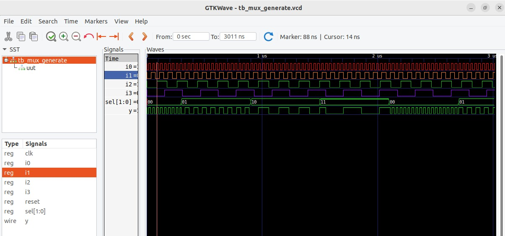

Commands to run synthesis.
```
read_liberty -lib ../lib/sky130_fd_sc_hd__tt_025C_1v80.lib
read_verilog mux_generate.v
synth -top mux_generate
abc -liberty ../lib/sky130_fd_sc_hd__tt_025C_1v80.lib
write_verilog mux_generate_net.v
show
```

As expected we get the `4:1 mux` generated along with a latch to store the output of the mux in the variable `y`.
The image below shows the synthesis output.

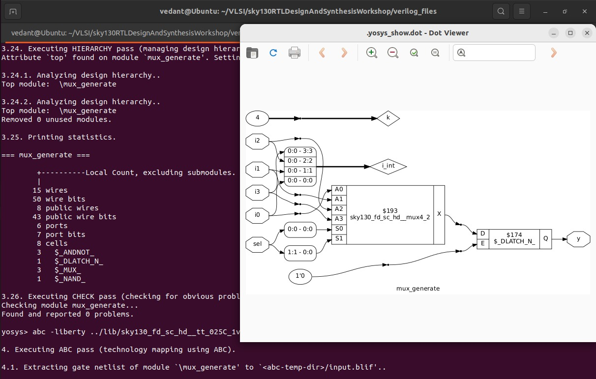

Command to run simulation for GLS.

```
iverilog ../my_lib/verilog_model/primitives.v ../my_lib/verilog_model/sky130_fd_sc_hd.v mux_generate_net.v tb_mux_generate.v
./a.out
gtkwave tb_mux_generate.vcd
```

The image below shows the post synthesis simulation. The simulation matches the pre-synthesis simulation.

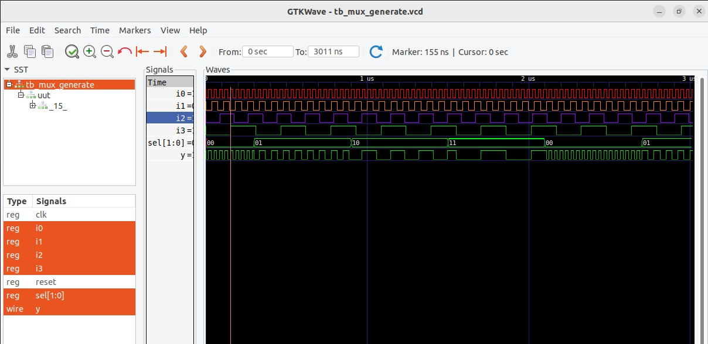


### Demux generation 1(demux_case.v)

Code
```
module demux_case (output o0, output o1, output o2, output o3, output o4, output o5, output o6, output o7, input [2:0] sel, input i);
    reg [7:0] y_int; 
    assign {o7, o6, o5, o4, o3, o2, o1, o0} = y_int; 
    
    always @ (*) begin
        y_int = 8'b00000000; 
        case (sel)
            3'b000 : y_int[0] = i; 
            3'b001 : y_int[1] = i;
            3'b010 : y_int[2] = i;
            3'b011 : y_int[3] = i;
            3'b100 : y_int[4] = i;
            3'b101 : y_int[5] = i;
            3'b110 : y_int[6] = i;
            3'b111 : y_int[7] = i;
        endcase
    end
    
endmodule
```

The image below shows the simulation.

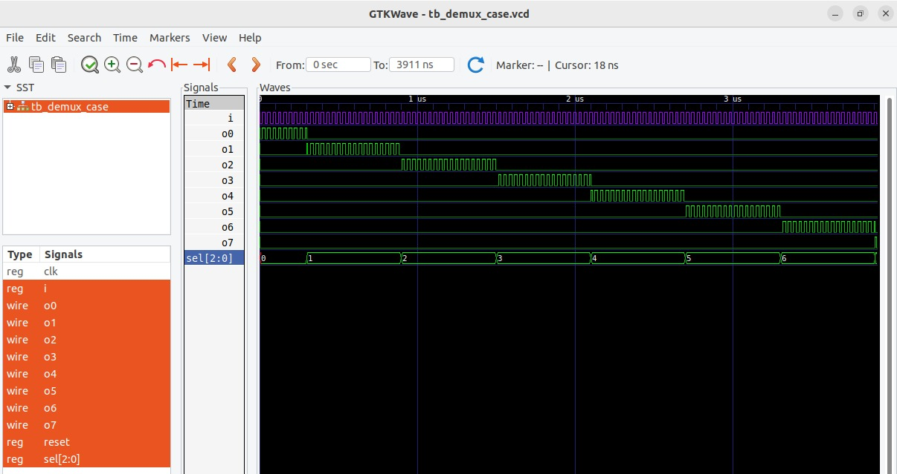

Commands to run synthesis.
```
read_liberty -lib ../lib/sky130_fd_sc_hd__tt_025C_1v80.lib
read_verilog demux_case.v
synth -top demux_case
abc -liberty ../lib/sky130_fd_sc_hd__tt_025C_1v80.lib
write_verilog demux_case_net.v
show
```

As expected we get the `1:8` generated along with a latch to store the output of the mux in the variable `y`.
The image below shows the synthesis output.

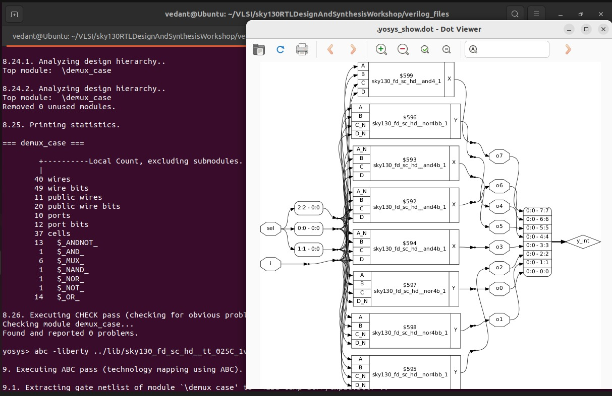

Command to run simulation for GLS.

```
iverilog ../my_lib/verilog_model/primitives.v ../my_lib/verilog_model/sky130_fd_sc_hd.v demux_case_net.v tb_demux_case.v
./a.out
gtkwave tb_demux_case.vcd
```

The image below shows the post synthesis simulation. The simulation matches the pre-synthesis simulation.

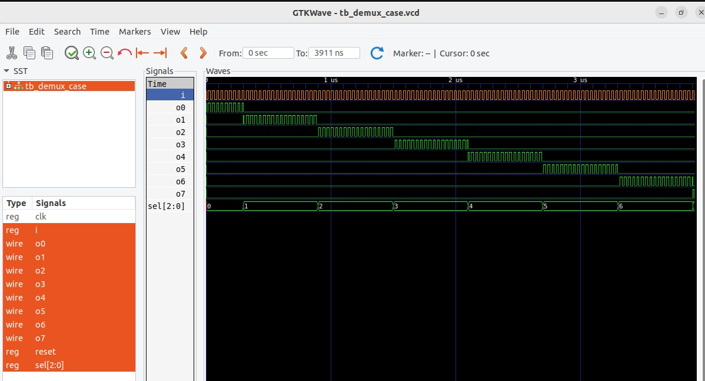


### Demux generation 2(demux_generate.v)

Code
```
module demux_generate (output o0, output o1, output o2, output o3, output o4, output o5, output o6, output o7, input [2:0] sel, input i);
    reg [7:0] y_int; 
    assign {o7, o6, o5, o4, o3, o2, o1, o0} = y_int; 
    integer k; 
    
    always @ (*) begin
        y_int = 8'b0; 
        for (k = 0; k < 8; k = k + 1) begin
            if (k == sel) 
                y_int[k] = i;
        end
    end
    
endmodule
```

The image below shows the simulation.

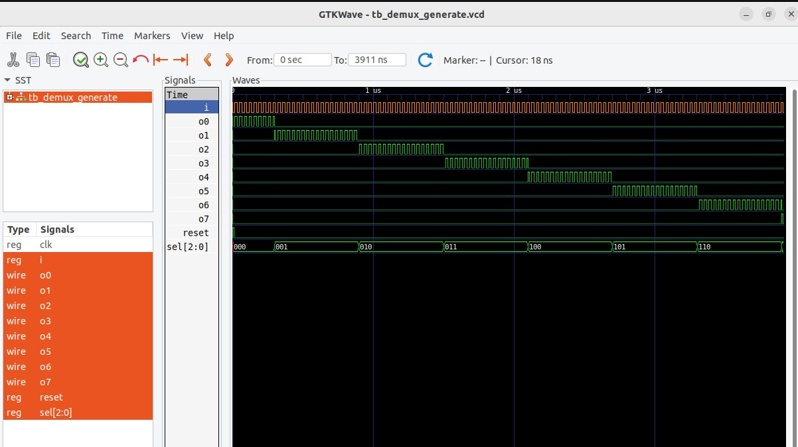

Commands to run synthesis.
```
read_liberty -lib ../lib/sky130_fd_sc_hd__tt_025C_1v80.lib
read_verilog demux_generate.v
synth -top demux_generate
abc -liberty ../lib/sky130_fd_sc_hd__tt_025C_1v80.lib
write_verilog demux_generate_net.v
show
```

As expected we get the `1:8` generated along with a latch to store the output of the mux in the variable `y`.
The image below shows the synthesis output.

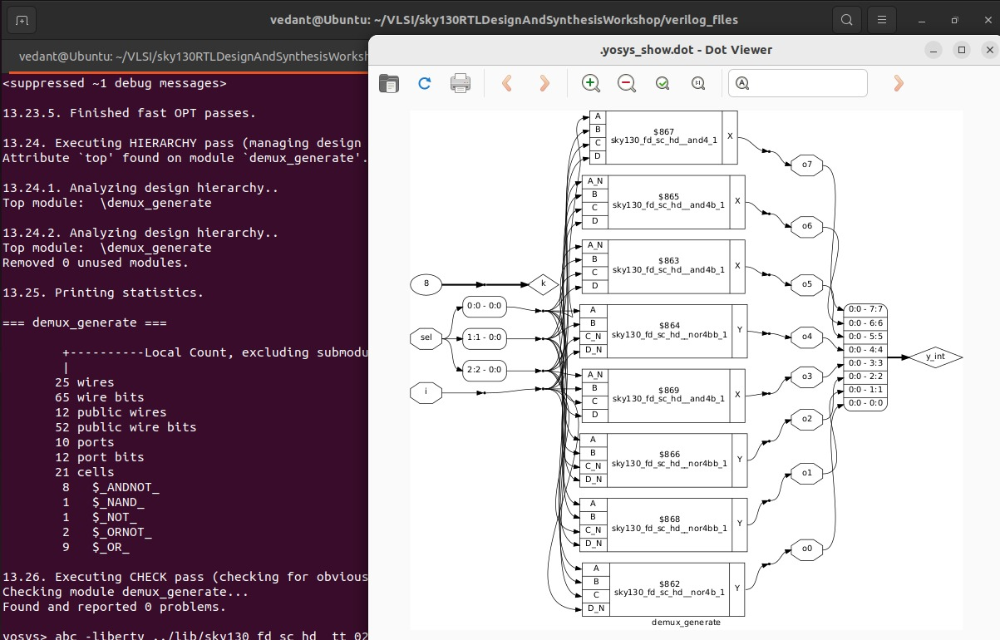

Command to run simulation for GLS.

```
iverilog ../my_lib/verilog_model/primitives.v ../my_lib/verilog_model/sky130_fd_sc_hd.v demux_generate_net.v tb_demux_generate.v
./a.out
gtkwave tb_demux_generate.vcd
```

The image below shows the post synthesis simulation. The simulation matches the pre-synthesis simulation.

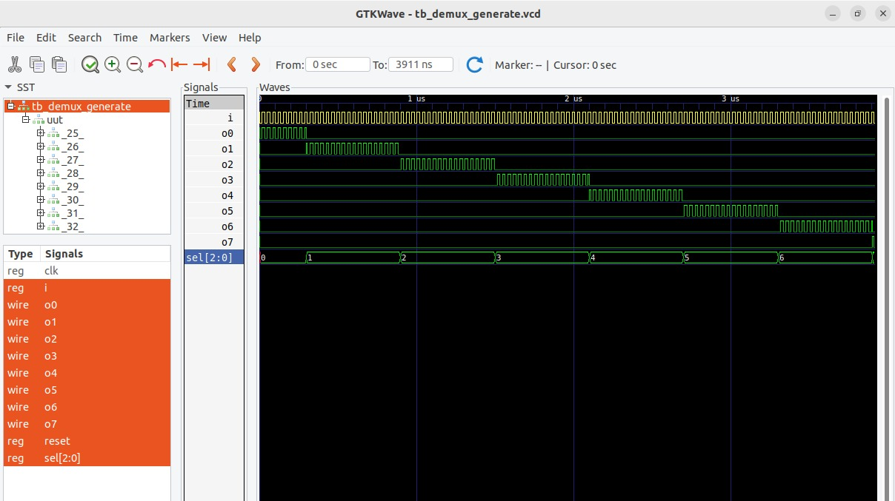

The output of both demux scenarios match with each other, proving that using for-loop is an easier method of coding the same logic for greate N.


## Labs on For Loop

### Ripple Carry Adder(rca.v)

Code
```
module fa (input a, input b, input c, output co, output sum);
    assign {co, sum} = a + b + c; 
endmodule


module rca (input [7:0] num1, input [7:0] num2, output [8:0] sum);
    wire [7:0] int_sum;
    wire [7:0] int_co; 
    genvar i; 

    fa u_fa_0 (.a (num1[0]),.b (num2[0]),.c (1'b0),.co (int_co[0]),.sum (int_sum[0]));

    generate
        for (i = 1; i < 8; i = i + 1) begin : fa_u_fa_i 
            fa u_fa_1 (.a (num1[i]),.b (num2[i]),.c (int_co[i-1]),.co (int_co[i]),.sum (int_sum[i]));
        end
    endgenerate

    assign sum[7:0] = int_sum;
    assign sum[8] = int_co[7]; 

endmodule
```

Command to run simulation.
```
iverilog fa.v rca.v rca_tb.v
./a.out
gtkwave rca_tb.vcd
```

The image below shows the simulation.

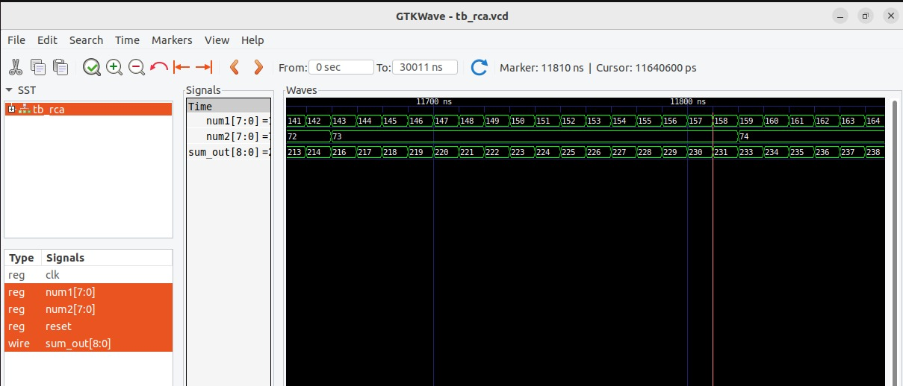

Commands to run synthesis.
```
read_liberty -lib ../lib/sky130_fd_sc_hd__tt_025C_1v80.lib
read_verilog fa.v rca.v
synth -top rca
abc -liberty ../lib/sky130_fd_sc_hd__tt_025C_1v80.lib
write_verilog rca_net.v
show rca
```

The image below shows the synthesis output.


Command to run simulation for GLS.

```
iverilog ../my_lib/verilog_model/primitives.v ../my_lib/verilog_model/sky130_fd_sc_hd.v rca_net.v tb_rca.v
./a.out
gtkwave tb_rca.vcd
```

The image below shows the post synthesis simulation. The simulation matches the pre-synthesis simulation.

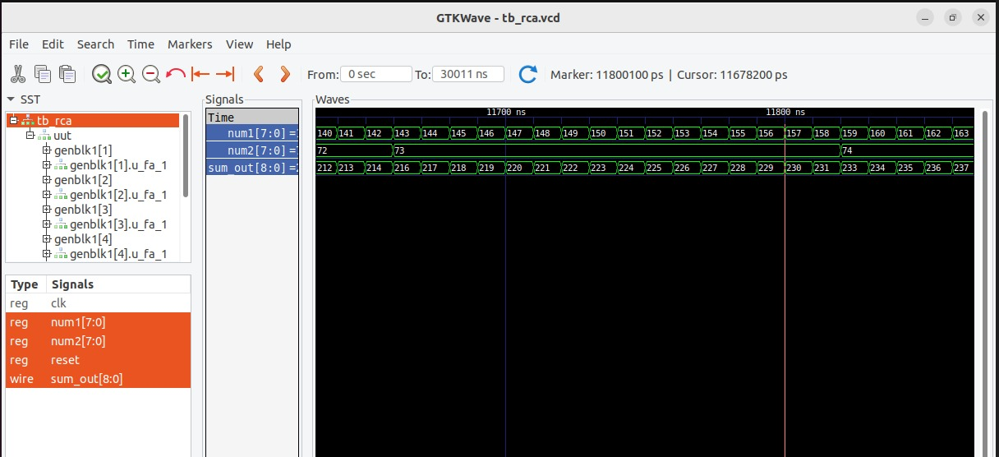

</details>


# WEEK 2

<details>

<summary><b> BabySoC Fundamentals & Functional Modelling </b></summary>

## Understanding System-on-Chip (SoC)

A System-on-Chip (SoC) is an integrated circuit that integrates almost all components of a computer or electronic system into a single chip. It functions as a complete system, contrasting with traditional designs that use separate chips for the Central Processing Unit (CPU), memory, and peripherals. SoCs are the foundation of modern, compact, and power-efficient electronics, such as smartphones, smartwatches, and IoT devices. They are valued for their space savings (compactness), energy efficiency (due to reduced distance for data transfer), and high performance.

### Components of a Typical SoC

A typical SoC is a complex integration of several functional blocks, connected via an internal communication fabric:

- CPU (Central Processing Unit): The brain of the SoC. It executes software instructions, performs calculations, and manages data processing. Modern SoCs often incorporate multiple CPU cores.
- Memory Subsystem: Includes various types of memory: RAM (Random Access Memory) for volatile, fast data storage during operation, and ROM/Flash for non-volatile storage (operating system, firmware), when the system is OFF.
- Peripherals/I/O Ports: Specialized hardware blocks that interface the SoC with the external world and other internal functions. Examples include: GPU (Graphics Processing Unit), DSP (Digital Signal Processor), Communication Modules (Wi-Fi, Bluetooth), Input/Output interfaces (USB, I2C), and custom blocks like the PLL (Phase-Locked Loop) and DAC (Digital-to-Analog Converter) in BabySoC.
- Interconnect Fabric: An on-chip network (often a bus or a Network-on-Chip, NoC) that provides the communication paths for the CPU, memory, and all peripherals to exchange data and control signals efficiently.


## BabySoC: A Simplified Model for Learning SoC

BabySoC (VSDBabySoC) is a simple, open-source teaching chip designed to make learning about complex Systems-on-Chip (SoCs) easier. It uses the RVMYTH RISC-V processor but leaves out the confusing parts of commercial chips, keeping only the basic, essential concepts.

### Why BabySoC is a Simplified Model

- Focused Components: It integrates a small, manageable set of essential components: the RVMYTH CPU, a Phase-Locked Loop (PLL) for precise clock generation, and a 10-bit Digital-to-Analog Converter (DAC) for analog interfacing. This limited scope allows us to focus on the interaction between a processor, timing mechanism, and an analog IP without getting overwhelmed around complex designs.
- Open-Source and Documented: Its foundation on the open-source RISC-V architecture and its highly documented design make its internals transparent, ideal for deep study and experimentation.
- Core Interface Demonstration: BabySoC clearly demonstrates a crucial design element: digital-to-analog interfacing. The system uses the RVMYTH CPU to process digital values, which are then fed to the DAC for conversion into an analog output (e.g., for audio/video), providing a tangible example of a mixed-signal design.
- Technology Exposure: The project is based on the Sky130 technology, giving us hands-on exposure to a real, open-source industrial fabrication process.


## Role of Functional Modeling in SoC Design Flow

Functional modeling is the critical first step in the SoC design flow, occurring before the Register-Transfer Level (RTL) and Physical Design stages.

### Functional Modeling

Focuses on Behavior (What it does). The output is a calidated C/C++ or high-level HDL model. It's crucial because it eliminates architectural errors early, before committing to hardware structure.

### RTL Design (Register-Transfer Level)

Focuses on Structure (How it's built). The output is detailed Verilog/VHDL code. It's crucial because it translates the function into a gate-level ready hardware description.

### Physical Design

Focuses on Layout (Where it goes). The output is the GDSII file (for fabrication). It's crucial because it deals with timing, power, and physical constraints of the actual chip.


In conclusion, the BabySoC platform is a great teaching tool because it connects theory to practice. It's a simple, open-source system that covers all the main SoC concepts, like how the CPU works, how to manage the clock, and how to convert digital signals to analog. This makes it an ideal way to see how functional modeling is crucial for building a successful final chip.

</details>


<details>

<summary><b>  Labs (Hands-on Functional Modelling) </b></summary>

## VSDBabySoC Modeling

This is the top-level module that integrates the rvmyth, pll, and dac modules.

```
  - Inputs:
     - reset: Resets the core processor.
     - VCO_IN, ENb_CP, ENb_VCO, REF: PLL control signals.
     - VREFH: DAC reference voltage.
  - Outputs:
     - OUT: Analog output from DAC.
     - Connections:
     - RV_TO_DAC - A 10-bit bus that connects the RISC-V core output to the DAC input.
     - CLK - The clock signal generated by the PLL.
```

### Installation

First we need to install some important packages,
```
$ sudo apt install make python python3 python3-pip git iverilog gtkwave docker.io
$ sudo chmod 666 /var/run/docker.sock
$ cd ~
$ pip3 install pyyaml click sandpiper-saas
```

Now we can clone this repository in an arbitrary directory.(Make sure that the sandpiper-saas and docker.io files are in the same path as the github repo.).
```
git clone https://github.com/manili/VSDBabySoC.git
```


### Pre-Synthesis Simulation

Run the following command to perform a pre-synthesis simulation.
```
iverilog -o output/pre_synth_sim/pre_synth_sim.out -DPRE_SYNTH_SIM \
    -I src/include -I src/module \
    src/module/testbench.v src/module/vsdbabysoc.v
cd output/pre_synth_sim
./pre_synth_sim.out

(OR)

cd VSDBabySoC
make pre_synth_sim
```

The result of the simulation (i.e.`pre_synth_sim.vcd`) will be stored in the `output/pre_synth_sim` directory.

Command to see the simulation using GTKwave.
```
gtkwave output/pre_synth_sim/pre_synth_sim.vcd
```

Two most important signals are `CLK` and `OUT`. The `CLK` signal is provided by the `PLL` and the `OUT` is the output of the `DAC model`. The image below shows the final result of the modeling process.


In this picture we can see the following signals:

**CLK**: This is the input `CLK` signal of the `RVMYTH` core. This signal comes from the `PLL`, originally.
**reset**: This is the `input reset` signal of the `RVMYTH` core. This signal comes from an external source, originally.
**OUT**: This is the output `OUT` signal of the `VSDBabySoC` module. This signal comes from the `DAC` (due to simulation restrictions it behaves like a digital signal which is incorrect), originally.
**RV_TO_DAC[9:0]**: This is the `10-bit output [9:0] OUT` port of the `RVMYTH` core. This port comes from the `RVMYTH register #17`, originally.
**OUT**: This is a real datatype wire which can simulate analog values. It is the output wire real `OUT` signal of the `DAC` module. This signal comes from the DAC, originally.

**PLEASE NOTE** that the sythesis process does not support real variables, so we must use the simple wire datatype for the `\vsdbabysoc.OUT` instead. The iverilog simulator always behaves wire as a digital signal. As a result we can not see the analog output via `\vsdbabysoc.OUT` port and we need to use `\dac.OUT` (which is a real datatype) instead.

The image below shows the command line output.

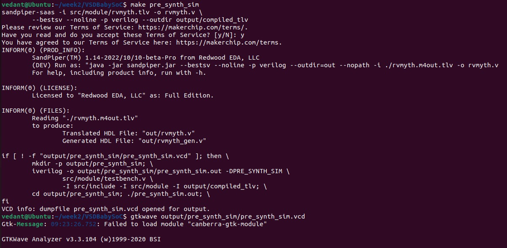


### Synthesis

To perform the synthesis process do the following.
```
cd ~/VSDBabySoC
make synth
```

We get the result in the `output/synth/vsdbabysoc.synth.v` file.


### Post-Synthesis Simulation(GLS)

Run the following command to perform a pre-synthesis simulation.
```
iverilog -o output/post_synth_sim/post_synth_sim.out -DPRE_SYNTH_SIM \
    -I src/include -I src/module \
    src/module/testbench.v src/module/vsdbabysoc.v
cd output/post_synth_sim
./post_synth_sim.out

(OR)

cd VSDBabySoC
make post_synth_sim
```

The result of the simulation (i.e.`post_synth_sim.vcd`) will be stored in the `output/post_synth_sim` directory.

Command to see the simulation using GTKwave.
```
gtkwave output/post_synth_sim/post_synth_sim.vcd
```

Two most important signals are `CLK` and `OUT`. The `CLK` signal is provided by the `PLL` and the `OUT` is the output of the `DAC model`. The image below shows the final result of the modeling process.

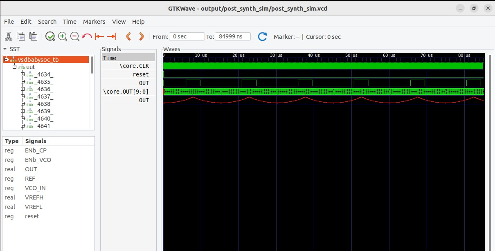

In this picture we can see the following signals:

- **\core.CLK**: This is the input `CLK` signal of the `RVMYTH` core. This signal comes from the `PLL`, originally.
- **reset**: This is the `input reset` signal of the `RVMYTH` core. This signal comes from an external source, originally.
- **OUT**: This is the output `OUT` signal of the `VSDBabySoC` module. This signal comes from the `DAC` (due to simulation restrictions it behaves like a digital signal which is incorrect), originally.
- **\core.OUT[9:0]**: This is the `10-bit output [9:0] OUT` port of the `RVMYTH` core. This port comes from the `RVMYTH register #17`, originally.
- **OUT**: This is a real datatype wire which can simulate analog values. It is the output wire real `OUT` signal of the `DAC` module. This signal comes from the DAC, originally.

**PLEASE NOTE** that the sythesis process does not support real variables, so we must use the simple wire datatype for the `\vsdbabysoc.OUT` instead. The iverilog simulator always behaves wire as a digital signal. As a result we can not see the analog output via `\vsdbabysoc.OUT` port and we need to use `\dac.OUT` (which is a real datatype) instead.

The image below shows the Synthesis output.

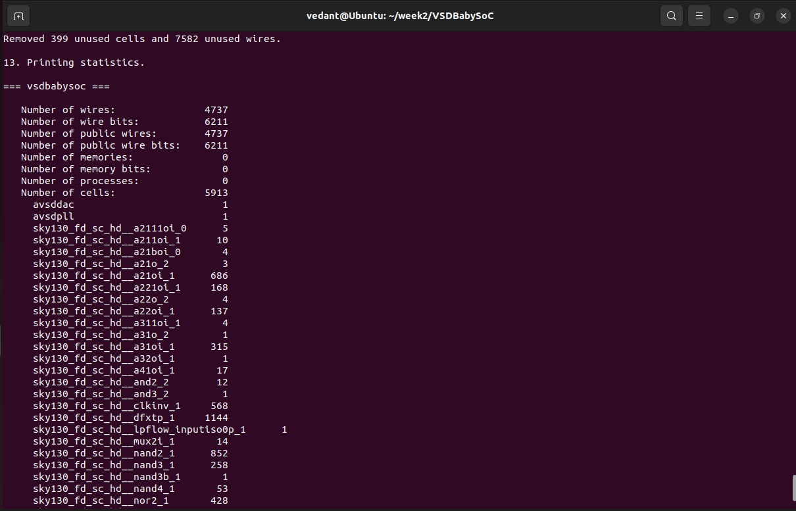


## Rvmyth Modeling (RISC-V Core)

The rvmyth module is a simple RISC-V based processor. It outputs a 10-bit digital signal (OUT) to be converted by the DAC.
```
  Inputs:
     - CLK: Clock signal generated by the PLL.
     - reset: Initializes or resets the processor.
  Outputs:
     - OUT: A 10-bit digital signal representing processed data to be sent to the DAC.
```

### Installation

Clone this repository in an arbitrary directory.
```
git clone https://github.com/manili/VSDBabySoC.git
```

### Pre-Synthesis Simulation

Run the following commands to perform a pre-synthesis simulation.
```
cd rvmyth
iverilog mythcore_test.v tb_mythcore_test.v
./a.out
gtkwave tb_mythcore_test.vcd
```

The image below shows the simulation output.

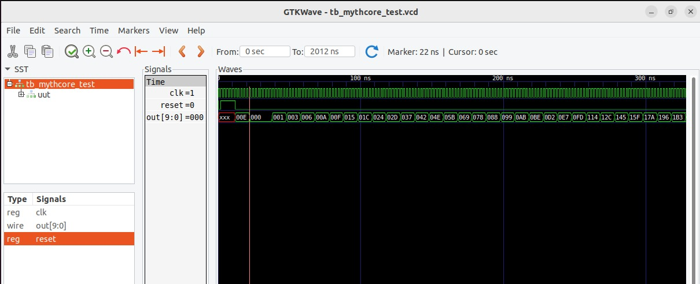

We can see from the simulation that the 10-bit digital processed data is coming as output (`out`) in synchronization with the `clock` signal.


## AVSDPLL Modeling (PLL Module)

The dac module converts the 10-bit digital signal from the rvmyth core to an analog output.
```
  Inputs:
     - VCO_IN, ENb_CP, ENb_VCO, REF: Control and reference signals for PLL operation.
  Output:
     - CLK: A stable clock signal for synchronizing the core and other modules.
```


## AVSDDAC Modeling (DAC Module)

The dac module converts the 10-bit digital signal from the rvmyth core to an analog output.
```
  Inputs:
     - D: A 10-bit digital input from the processor.
     - VREFH: Reference voltage for the DAC.
  Output:
     - OUT: Analog output signal.
```

### Installation

Clone this repository in an arbitrary directory.
```
git clone https://github.com/vsdip/rvmyth_avsddac_interface.git
```

### Pre-Synthesis Simulation

Run the following commands to perform a pre-synthesis simulation.
```
cd rvmyth_avsddac_interface/iverilog/Pre-synthesis
iverilog avsddac.v avsddac_tb_test.v
./a.out
gtkwave avsddac_tb_test.vcd
```

The image below shows the simulation output.

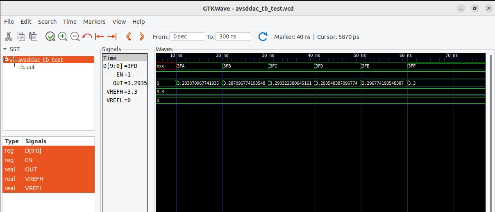

In this picture we can see the following signals:

- **D[9:0]**: DAC 10-bit digital input.
- **EN**: Enable is high for the block to be active.
- **OUT**: Corresponding analog values to the input D, as the output.
- **VREFH**: Reference voltage high = 3.7V .
- **VREL**: Reference voltage low = 0V .

Now integrate both rvymth and DAC using a Top level module and test it to verify the correctness of the integration.

Run the following commands to perform a pre-synthesis simulation.
```
iverilog rvmyth_avsddac.v rvmyth_avsddac_TB.v
./a.out
gtkwave rvmyth_avsddac.vcd
```

The image below shows the simulation output.

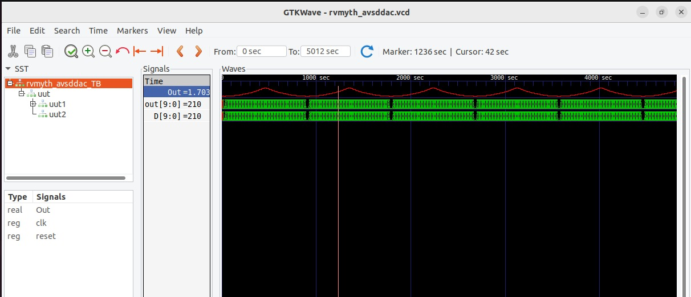

In this picture we can see the following signals:

- **out[9:0]**: rvymth 10-bit digital output.
- **D[9:0]**: DAC 10-bit digital input.
- **Out**: DAC analog output.


</details>


# WEEK 3

<details>

<summary><b> Post-Synthesis GLS & STA Fundamentals </b></summary>

## Post-Synthesis GLS

### Key-aspects of GLS for BabySoC

1) Verification with Timing Information:
- GLS is performed using Standard Delay Format (SDF) files to ensure timing correctness.
- This checks if the SoC behaves as expected under real-world timing constraints.
  
2) Design Validation Post-Synthesis:
- Confirms that the design's logical behavior remains correct after mapping it to the gate-level representation.
- Ensures that the design is free from issues like metastability or glitches.

3) Simulation Tools:
- Icarus Verilog(iVerilog) is used for compiling and running the gate-level netlist.
- Yosys is used to generate the netlist from the given RTL codes and libraries.
- Waveforms are analyzed using GTKWave.


Below mentioned are the generalized steps for running the GLS from start.

Load the Top-Level Design and Supporting Modules.
```
yosys
read_verilog /home/vedant/VSDBabySoC/src/module/vsdbabysoc.v
read_verilog -I /home/vedant/VSDBabySoC/src/include /home/vedant/VSDBabySoC/src/module/rvmyth.v
read_verilog -I /home/vedant/VSDBabySoC/src/include /home/vedant/VSDBabySoC/src/module/clk_gate.v
```

Load the Liberty Files for Synthesis.
```
read_liberty -lib /home/vedant/VSDBabySoC/src/lib/avsdpll.lib
read_liberty -lib /home/vedant/VSDBabySoC/src/lib/avsddac.lib
read_liberty -lib /home/vedant/VSDBabySoC/src/lib/sky130_fd_sc_hd__tt_025C_1v80.lib
```

Run Synthesis Targeting vsdbabysoc.
```
synth -top vsdbabysoc
```

Map D Flip-Flops to Standard Cells.
```
dfflibmap -liberty /home/vedant/VSDBabySoC/src/lib/sky130_fd_sc_hd__tt_025C_1v80.lib
```

Perform Optimization and Technology Mapping.
```
opt
abc -liberty /home/vedant/VSDBabySoC/src/lib/sky130_fd_sc_hd__tt_025C_1v80.lib -script +strash;scorr;ifraig;retime;{D};strash;dch,-f;map,-M,1,{D}
```

Perform Final Clean-Up and Renaming.
```
flatten
setundef -zero
clean -purge
rename -enumerate
```

Check stat and write the Synthesized Netlist.
```
stat
write_verilog -noattr /home/vedant/VSDBabySoC/output/post_synth_sim/vsdbabysoc.synth.v
```

Run the following iverilog command to compile the testbench.
```
iverilog -o /home/vedant/VSDBabySoC/output/post_synth_sim/post_synth_sim.out -DPOST_SYNTH_SIM -DFUNCTIONAL -DUNIT_DELAY=#1 -I /home/vedant/VSDBabySoC/src/include -I /home/vedant/VSDBabySoC/src/module /home/vedant/VSDBabySoC/src/module/testbench.v
```

Run the Simulation and view using GTKWave.
```
cd output/post_synth_sim/
./post_synth_sim.out
gtkwave post_synth_sim.vcd
```


As I could not find the `rvymth.v` code in the repositories shared in all the pdfs till now, I used the make file to run the GLS and generate the simulation for the gtkwave Post-synthesis.

The commands used to do this are given below along with pre-synthesis and post-synthesis outputs.

Clone the repository
```
git clone https://github.com/manili/VSDBabySoC.git
```

Command to run the simulation(Pre-Synthesis)
```
cd VSDBabySoC
make pre_synth_sim

gtkwave output/pre_synth_sim/pre_synth_sim.vcd
```

The image below shows the output of the Pre-synthesis simulation.


Command to run synthesis(GLS)
```
cd VSDBabySoC
make synth
```

The image below shows the command-line output post Synthesis.


Command to run the simulation(Post-Synthesis)
```
cd VSDBabySoC
make post_synth_sim

gtkwave output/post_synth_sim/post_synth_sim.vcd
```

The image below shows the output of the Post-synthesis simulation.


We can clearly see from the Pre-Synthesis and Post-Synthesis simulation outputs that are attached `GLS = Functional outputs`.
The waveforms show the same set of variables simulated with matching outputs.


## Fundamentals of STA (Static Timing Analysis) 


### Timing Analysis Summary

Static Timing Analysis (STA) ensures reliable data transfer across sequential elements by verifying timing paths with respect to the clock.  
Each **timing path** is analyzed to confirm that **setup** and **hold** requirements are met for all signals.


### Path-Based Analysis

Each path in the circuit is defined as:

- **Start Point:** Flip-Flop (FF) **clock pin** or **input port**  
- **End Point:** Flip-Flop (FF) **data (D) pin** or **output port**

Logic gates are represented as **nodes** forming a **Directed Acyclic Graph (DAG)**.  
A **source** and **sink** node are added to compute:  

- **AAT (Actual Arrival Time)**  
- **RAT (Required Arrival Time)**  

**Slack = RAT − AAT**  
Positive slack → timing met 
Negative slack → violation 


### Setup and Hold Checks

| Type | Purpose | Delay Type | Slack Term | Condition |
|------|----------|-------------|-------------|------------|
| **Setup Analysis** | Ensures data arrives **before** next clock edge | **Max delay** | **Setup Slack (Max Slack)** | Data must settle before capture |
| **Hold Analysis** | Ensures data remains **stable after** same clock edge | **Min delay** | **Hold Slack (Min Slack)** | Data must not change too early |

**Path types analyzed:**
- `reg → reg`
- `in → reg`
- `reg → out`
- `in → out`
- Clock gating  
- Recovery/Removal  
- Data–Data  
- Latch (Time-Borrow / Time-Given)


### Clock Definitions and Analysis

Accurate **clock definition** is vital for STA. Clock parameters directly influence setup/hold margins:

- **Clock Skew:** Difference in clock arrival times at start and end points  
- **Pulse Width:** Ensures proper clock duty cycle  
- **Clk-to-Q Delay:** Time for FF output to respond to a clock edge  

All these affect the **effective data arrival** and **required times** used for slack computation.


### Slew and Load Analysis

| Category | Parameters Checked | Purpose |
|-----------|--------------------|----------|
| **Slew / Transition** | Data (min/max), Clock (min/max) | Ensures valid rise/fall times |
| **Load Analysis** | Fanout (min/max), Capacitance (min/max) | Determines delay due to loading |


### Final Timing Computation Flow

1. Define clocks and identify start/end points  
2. Convert logic into nodes → form **DAG**  
3. Calculate **AAT** (data arrival) and **RAT** (required time)  
4. Compute **Setup and Hold Slack**  
5. Verify no negative slack exists (timing closure achieved)


### Conclusion 

STA validates that signals launched from **FF clock/input** reach the **FF D/output** on time, meeting both **setup (max)** and **hold (min)** constraints, guided by clock behavior, path delays, and load characteristics.


</details>
