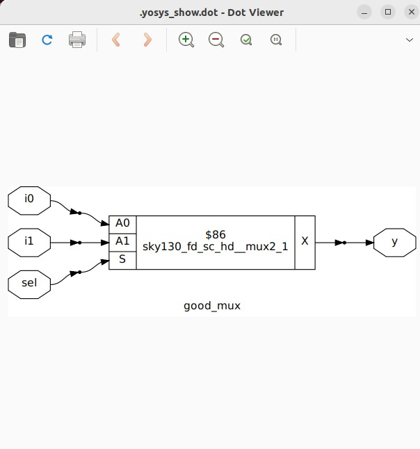

# RISC-V-Reference-SoC-Tapeout-Program

<details>
<summary><b> Day 0 - Tools Installation</b></summary>

Understanding the flow of the tapeout program.  

The 4 major outputs i.e. the output of the "c"-code, the verilog code, the SoC output and the output of the tapeout chip should be the same. Basically the functionality is being checked at 4 major stages of the asic flow ensuring that the final product is in terms with the design application.  

## Yosys
```
$ sudo apt-get update
$ git clone https://github.com/YosysHQ/yosys.git
$ cd yosys
$ sudo apt install make (If make is not installed please install it)
$ sudo apt-get install build-essential clang bison flex \
 libreadline-dev gawk tcl-dev libffi-dev git \
 graphviz xdot pkg-config python3 libboost-system-dev \
 libboost-python-dev libboost-filesystem-dev zlib1g-dev
$ make config-gcc
$ make
$ sudo make install 
```


## Iverilog
```
sudo apt-get update
sudo apt-get install iverilog 
```


## GTKWave
```
sudo apt-get update
sudo apt install gtkwave 
```


</details>

<details>
<summary><b> Day 1 - Introduction to Verilog RTL Design and Synthesis</b></summary>

## Introduction to open-source simulator Iverilog

RTL design is simulated to check for its adherence wrt to the spec. To simulate we use Iverilog.

We use a testbench to instantiate the values for the Verilog code variables which is given as input to check for both the verilog code simulation as well as for the netlist.

Folder structure of the git clone:

- `lib` - contains sky130 standard cell library
- `my_lib/verilog_models` - contains all the standard cells verilog model
- `verilog_files` - contains the lab experiments source files

Command to run the design and testbench

```
iverilog good_mux.v tb_good_mux.v
```

Output of iverilog is vcd file which is given as input to gtkwave. A a.out file is created, executing which the iverilog dumps the vcd file.

## Introduction to GTKWave

gtkwave is used to display the waveforms, giving the vcd file as the input.

Command to view the vcd file in gtkwave

```
./a.out
gtkwave tb_good_mux.vcd
```
The image below shows the waveform generated.


## Introduction to Yosys

Yosys is a synthesizer which converts the RTL code to gate-level netlist. The verilog code along with the lib file are the inputs given to it, which then generates the gate-level netlist as the output.

## Using Yosys Sky130 PDKs and verilog codes

The images below show the hierarchy of the commands used to generate the netlist. It starts with syntax checking and analysing the verilog code and mapping it to general gates. Then we map the boolean logic to standard cells from the .lib file.

Be in the verilog_codes directory and follow the below commands

```
yosys
read_liberty -lib ../lib/sky130_fd_sc_hd__tt_025C_1v80.lib
read_verilog good_mux.v
synth -top good_mux.v
abc -liberty ../lib/sky130_fd_sc_hd__tt_025C_1v80.lib
show
```




The below image shows the generated netlist as the output of the synthesis procedure and to do that follow the below code.

```
write_verilog <module_name>
!vim <module_name>
```


</details>


<details>
<summary><b> Day 2 - Timing libs, Hierarchical vs Flat Synthesis and Efficient Flop Coding Styles</b></summary>

## Introduction to timing .lib

Libraries are defined on the basis of PVT contraints (P-process, V-voltage, T-temperature).

The below image shows the PVT constraints:
- tt stands for typical in the .lib name
- 025C stands for temperature of 25 C in the .lib name
- 1v80 stands for voltage of 1.8V in the .lib name

```
!vim ../lib/sky130_fd_sc_hd__tt_025C_1v80.lib
```


'-cell' marks the start of the cell. It consists of different characteristics of the cell as mentioned below:
- Area
- Power associated with pin
- Width
- Delay
- Input capacitance
- Transition

Same cell(same logic functionality) will have different types, having different characteristics in terms of area and other parameters.

## Hierarchical vs Flat Synthesis

### Hierarchical Synthesis

The image below shows the report of synthesising the multiple_modules.v. The code has both the sub-modules instantiated.


We can see both the sub-modules- the And gate and the Or gate have been instantiated differently. Rather than seeing AND or OR gate, we see sub_modules when we run the command 'show' as shown in the screenshot. Basically, the hierarchy is preserved. This is an example of Hierarchical Synthesis.


If we look into the sub_module2 in synthesized netlist 'multiple_modules_hier.v', we see that rather than OR gate, the inputs a & b, pass through the inverter and then NAND gate. It is because in CMOS, stacking PMOS, which happens in 'OR' gate is bad as PMOS has lower mobility than NMOS, which is stacked in NAND gate, and always have to be wider to get some meaningful output. One can also say that the charing and dishcharging is faster in a NANd gate compared to NOR or other gates. The next step is to check .lib file for the answer.


### Flat Synthesis

The design can be flattened by using the command `flatten`.

The image below shows the code along with the generated netlist and the logical diagram output. Here one can see that the submodules aren not instantiated. Rather the gates have been instantiated in the logical diagram along with the module names. This proves that flattening has broken down the hierarchy.


### Sub-module Level Synthesis

RTL (Register Transfer Level) designs are often modular, with various functional blocks or sub-modules. Sub-module level synthesis allows each of these sub-modules to be synthesized independently.

Sub-module level synthesis is necessary for the following reasons:-
- Optimization and Area Reduction: By synthesizing sub-modules separately, the synthesis tool can optimize each one individually. It performs logic optimization, technology mapping, and area minimization for each sub-module. This leads to more efficient use of resources and reduced overall chip area.
- Reusability: When we have multiple instances of the same module, synthesizing one will save resources and time.
- Parallel Processing: To divide and conquer i.e. it is more efficient to synthesise each module concurrently when the design is massive. It helps reduce the TAT.

The commands to run sub-module synthesis:

```
read_liberty -lib ../lib/sky130_fd_sc_hd__tt_025C_1v80.lib
read_verilog multiple_modules.v
synth -top sub_module1
abc -liberty ../lib/sky130_fd_sc_hd__tt_025C_1v80.lib
show
```

The image below shows the synthesis of the sub-module1. 


## Various Flop Coding Styles and Optimization

### How to prevent glitches in the circuit? How do flip-flops help here?

Glitches can occur in digital circuits due to various reasons such as signal delays, noise, or timing issues. Flops prevent glitches during the operation in the following ways:

- Synchronization: Flops are edge-triggered devices, meaning they respond only to transitions of the input signal (e.g., rising edge, falling edge). This synchronization ensures that the output changes only at specific points, reducing the likelihood of glitches caused by transient signal variations.
- Timing Control: Flops are typically controlled by a clock signal, ensuring that all circuit operations occur synchronously. This eliminates timing issues that could lead to glitches due to data arriving at different times.


### Different types of FLops:

The type of flop changes on the basis of the set-reset signals and their usage.

The image below shows the codes of different type of flops.


The image below shows DFF with asynchronous reset HDL simulation in Iverilog and waveform display in GTKwave. Irrespective of the clock and d, as soon as async_reset=1, q=0.


The image below shows DFF with asynchronous set HDL simulation in Iverilog and waveform display in GTKwave. Irrespective of the clock and d, as soon as async_set=1, q=1.


### Synthesis of Flops

Below are the commands to synthesize DFF with asynchronous reset.
```
read_liberty -lib ../lib/sky130_fd_sc_hd__tt_025C_1v80.lib
read_verilog dff_asyncres.v
synth -top dff_asyncres
dfflibmap -liberty ../lib/sky130_fd_sc_hd__tt_025C_1v80.lib
abc -liberty ../lib/sky130_fd_sc_hd__tt_025C_1v80.lib
show
```


On synthesizing DFF with synchronous reset we get NOR gate with inverted d as shown in the image below. However, on evaluating the boolean expression, we reach the same logic realization. 
The flow of commands remains the same. Just have to change the name of the file accordingly.


## Synthesizing mult2 (multiply by 2)

To implement `y[3:0] = 2*a[2:0]`, we append a `1'b0` to the `a[2:0]` i.e, `y[3:0] = {a[2:0],0}`. This is also equal to left shift the input bits by 1. This can be realized by just wiring. So we expect no hardware which is also seen in the screenshot below, analysis after synthesis and show. The command 'abc' is not required for mapping when there are no cells.


## Synthesizing mult9 (multiply by 9)

`y=9*a` can be considered `8*a+1*a` To implement `y[5:0] = 9*a[2:0]`, we append 000 to a[2:0] and then add a i.e, `y[5:0] = {a[2:0],000} + a[2:0]`. This can be realized just by wiring. So we expect no hardware which is also seen in the screenshot below, analysis after synthesis and show. The command 'abc' is not required for mapping when there are no cells.


The multiply by 2 and multiply by 9 are special cases of synthesis, which post synthesis donot use any registers.
</details>


<details>
<summary><b> Day 3 - Combinational and Sequential Optimizations</b></summary>

## Introduction to Optimizations

### Combinational Logic Optimization

It means squeezing the logic to get the most optimized design in terms of area and power. the most commonly used techniques are:
- Constant propagation using direct optimization
- Boolean logic optimization using K-map(<5 variables) and Quine McKlusky(>5 variables)

The image below is an example of constant propogation.


The image below is an example of boolean logic optimization.


### Sequential Logic Optimization

The technqiues used are:

1) Basic
- Sequential constant propagation
2) Advanced 
- Static optimization
- Retiming
- Sequential logic cloning (floorplan aware synthesis)

An example of sequential constant propagation is of DFF with asynchronous reset where D input is grounded. Here one can just conclude `y = 1`. 

To note, the same technique cannot be applied to DFF with the asynchronous set because while `Q=1` when `Set=1`, but `Q=0` at `Set=0` at the next CLK pulse. Q is dependent not only on Set but also on the clock edge.

Retiming is a technique to improve the performance of the circuit. Here one can switch the logical implementation circuit between FFs to next/prior set of FFs in order to increase the performance of the circuit.


## Combinational Logic Optimizations

Command used for optimization:
```
opt_clean -purge
```

### Optimization of opt_check.v

Code
```
module opt_check (input a , input b , output y);
        assign y = a?b:0;
endmodule
```

For opt_check.v the assignment `y = a?b:0` reduces to `y = ab`. 

The logic implementation after synthesis for opt_check.v is shown below, showing only AND gate.


### Optimization of opt_check2.v

Code
```
module opt_check2 (input a , input b , output y);
        assign y = a?1:b;
endmodule
```

For opt_check2.v the assignment `y = a?1:b` reduces to `y = a+b`. 

The logic implementation after synthesis for opt_check2.v is shown below, showing only OR gate.


### Optimization of opt_check3.v

Code
```
module opt_check3 (input a , input b, input c , output y);
	       assign y = a?(c?b:0):0;
endmodule
```

For opt_check3.v the assignment `y = a?(c?b:0):0` reduces to `y = a+b`. 

The logic implementation after synthesis for opt_check3.v is shown below, showing 3 input AND gate.


### Optimization of opt_check4.v

Code
```
module opt_check3 (input a , input b, input c , output y);
	       assign y = a?(b?c:(c?a:0)):(!c);
endmodule
```

For opt_check4.v the assignment `y = a?(b?c:(c?a:0)):(!c)` reduces to `y = a xnor b`. 

The logic implementation after synthesis for opt_check4.v is shown below, showing 3 input AND gate.


### Optimization of multiple_module_opt.v

Code
```
module sub_module1(input a , input b , output y);
 assign y = a & b;
endmodule

module sub_module2(input a , input b , output y);
 assign y = a^b;
endmodule

module multiple_module_opt(input a , input b , input c , input d , output y);
wire n1,n2,n3;

sub_module1 U1 (.a(a) , .b(1'b1) , .y(n1));
sub_module2 U2 (.a(n1), .b(1'b0) , .y(n2));
sub_module2 U3 (.a(b), .b(d) , .y(n3));

assign y = c | (b & n1); 
endmodule
```

For multiple_module_opt.v the boolean logic reduces to `y = c | (a & b)`. 

The logic implementation after synthesis for multiple_module_opt.v is shown below.


### Optimization of multiple_module_opt2.v

Code
```
module sub_module1(input a , input b , output y);
 assign y = a & b;
endmodule

module multiple_module_opt(input a , input b , input c , input d , output y);
wire n1,n2,n3;

sub_module1 U1 (.a(a) , .b(1'b0) , .y(n1));
sub_module1 U2 (.a(b), .b(c) , .y(n2));
sub_module1 U3 (.a(n2), .b(d) , .y(n3));
sub_module1 U4 (.a(n3), .b(n1) , .y(y));

endmodule
```

For multiple_module_opt.v the boolean logic reduces to `y = 1'b0`. 

The logic implementation after synthesis for multiple_module_opt.v is shown below.


</details>
